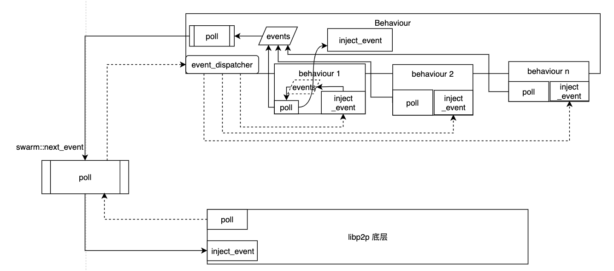
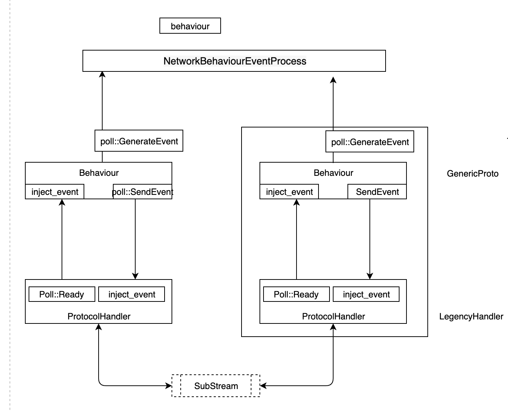
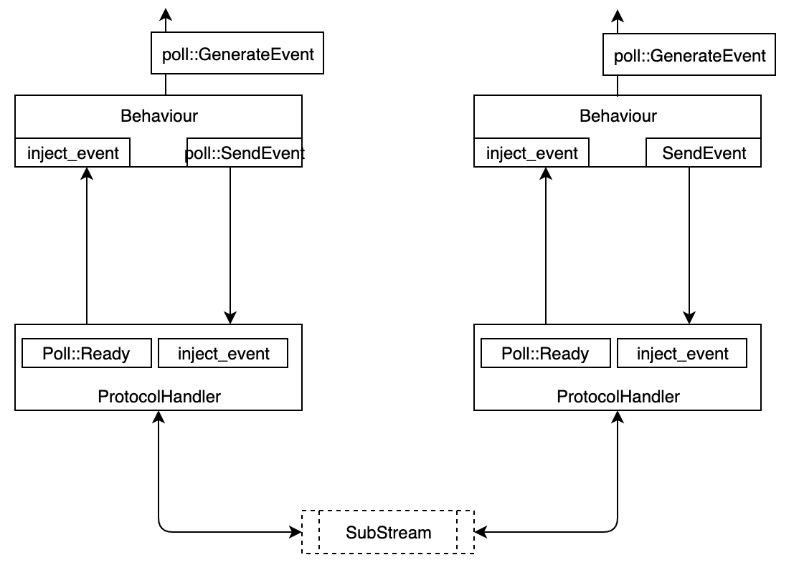

# Behaviour说明
[注释翻译]
网络行为，允许定制swarm的行为  
<font color="red"> 本特征被设计成可组合的，可以把多种实现组合成一种，这样可以一次性处理所有的行为 </font>

## 派生 `NetworkBehaviour`

 板箱模块的用户可以通过使用由 `libp2p`导出的宏`#[derive(NetworkBehaviour)]`来实现本特征。该宏生成一个实现该`struct`的代理`trait`，用于代理特征定义的所有的函数调用。结构体所有产生的事件都被代理到`NetworkBehaviourEventProcess`，这个函数应该由使用者实现。  

自定义的`poll`函数是可选的，这个函数必须添加`#[behaviour(poll_method = "poll")]`标签属性，并且会在最终以无参数的形式调用。  

在默认情况下，派生者设置`NetworkBehaviour::OutEvent` 为 `()`，但是这个可以用`#[behaviour(out_event = "AnotherType")]`宏来覆盖。  

如果结构体的某字段没有实现`NetworkBehaviour`，可以在该字段上添加`#[behaviour(ignore)]`宏来禁止产生此字段的代理。

### 特征定义
* ProtocolsHandler
* OutEvent
* new_handler
* addresses_of_peer
* inject_connected
* inject_disconnected
* inject_replaced
* inject_node_event
* inject_addr_reach_failure
* inject_dial_failure

## ProtocolHandler
用于处理与某个远端的连接上的一组协议的处理器。  
当一个类型需要管理与某个远端连接的特定协议的状态时，需要实现本特征。  

### 处理协议
与包含一组协议远端的通信通过以下两种方式之一进行初始化：
1. 通过初始化一个出站子流来进行初始化。要想达到这个目的：[`ProtocolsHandler::poll()`]必须返回一个[`libp2p_core::upgrade::OutboundUpgrade`]实例的[`ProtocolsHandlerEvent::OutboundSubstreamRequest`]，该实例可用于进行协议协商。当成功时，会以最终升级结果为参数调用[`ProtocolsHandler::inject_fully_negotiated_outbound`]
   *备注* 升级一词的来源是因为初始化的时候是以某一个子流协商，最终得到了所有的协议，因此称为升级。 
2. 监听并且接受入站的子流，当在一个连接上建立一个新的入站子流时，[`ProtocolsHandler::listen_protocol`] 将被调用以获得一个[`libp2p_core::upgrade::InboundUpgrade`]实例，该实现用于协议协商。当成功时会以最终升级结果为参数调用[`ProtocolsHandler::inject_fully_negotiated_inbound`]

### 连接保持
`ProtocolsHandler`能够通过[`ProtocolsHandler::connection_keep_alive`]影响低层的连接。也就是说，处理器所实现的协议能够包括终目连接的条件，成功协商后的子流的生命周期完全由处理器来控制。  

本特征的实现者必须注意连接可能在任何时刻被关闭。当一个连接被优雅地关闭，该处理器使用的子流仍旧可以继续读取数据，直到远端也关闭了这个连接。

### 特征定义


## 实现自定义的逻辑
通常的方式是在behaviour中添加一个枚举类型 
```rust
/// Event that can be emitted by the behaviour.
#[derive(Debug)]
pub enum BehaviourOut<TMessage> {
    /// Opened a custom protocol with the remote.
    CustomProtocolOpen {
        /// Identifier of the protocol.
        protocol_id: ProtocolId,
        /// Version of the protocol that has been opened.
        version: u8,
        /// Id of the node we have opened a connection with.
        peer_id: PeerId,
        /// Endpoint used for this custom protocol.
        endpoint: ConnectedPoint,
    },
   ....
}
```
和一个事件队列：
```rust
    /// Queue of events to produce for the outside.
    #[behaviour(ignore)]
    events: Vec<BehaviourOut<TMessage>>,
```
在事件发生时放到这个列表：  
>    由此处明显看出NetworkBehaviourEventProcess是有事件发生时的回调函数，这个作用就是把消息放入event队列中：  
>    个人的观点(从字面上看，是把Identif类型替换成了BehaviourOut::Identified类型):看起来是把这个消息从各个子流中取出，然后放到主behaviour的events中去，这个后续需要进一步验证
```rust
impl<TMessage, TSubstream> NetworkBehaviourEventProcess<IdentifyEvent> for Behaviour<TMessage, TSubstream> {
    fn inject_event(&mut self, event: IdentifyEvent) {
        match event {
            IdentifyEvent::Identified { peer_id, mut info, .. } => {
            ...
            self.events.push(BehaviourOut::Identified { peer_id, info });
            ...
         }
      }
   }
}
```
并且在behaviour中添加一个poll过程来产生消息：
```rust
impl<TMessage, TSubstream> Behaviour<TMessage, TSubstream> {
    fn poll<TEv>(&mut self) -> Async<NetworkBehaviourAction<TEv, BehaviourOut<TMessage>>> {
        if !self.events.is_empty() {
            return Async::Ready(NetworkBehaviourAction::GenerateEvent(self.events.remove(0)))
        }

        Async::NotReady
    }
}
```
你需要在派生类上添加一个属性来使它能够工作：
```rust
/// General behaviour of the network. Combines all protocols together.
#[derive(NetworkBehaviour)]
#[behaviour(out_event = "BehaviourOut<B>", poll_method = "poll")]
pub struct Behaviour<B: BlockT, H: ExHashT> {
    /// All the substrate-specific protocols.
    substrate: Protocol<B, H>,
    /// Periodically pings and identifies the nodes we are connected to, and store information in a
    /// cache.
    debug_info: debug_info::DebugInfoBehaviour,
    /// Discovers nodes of the network.
    discovery: DiscoveryBehaviour,
    /// Block request handling.
    block_requests: protocol::BlockRequests<B>,
    /// Light client request handling.
    light_client_handler: protocol::LightClientHandler<B>,
    /// Queue of events to produce for the outside.
    #[behaviour(ignore)]
    events: Vec<BehaviourOut<B>>,
}
```
参考"派生 `NetworkBehaviour`",可以得到如下结论
<font color="red">在这个声明中，做了以下几件事：
1. 自动为substrate、debug_info、discovery、block_requests和light_client_handler属性代理behaviour行为
2. events属性由于有`#[behaviour(ignore)]`不会代理behaviour行为
3. 事件输出类型为`BehaviourOut<B>`
4. 支持`poll`
5. 在一个结构声明里组合了substrate、debug_info、discovery、block_requests和light_client_handler行为，即一开始的"本特征被设计成可组合的，可以把多种实现组合成一种，这样可以一次性处理所有的行为"
</font>
Polling Swarm将产生这些事件：
```rust
/// Polls for what happened on the network.
    fn poll_swarm(&mut self) -> Poll<Option<ServiceEvent<TMessage>>, IoError> {
        loop {
            match self.swarm.poll() {
                Ok(Async::Ready(Some(BehaviourOut::CustomProtocolOpen { protocol_id, peer_id, version, endpoint }))) => {
               ...
            }
            ...
            }
            ...}
            
```

## 数据收发处理  
当上述改造完毕后，数据的收发通过 Ready(NetworkBehaviourAction）来实现,这个里面包括5种类型

```rust
pub enum NetworkBehaviourAction<TInEvent, TOutEvent> {
    GenerateEvent(TOutEvent),
    DialAddress {
        address: Multiaddr,
    },
    DialPeer {
        peer_id: PeerId,
    },
    SendEvent {
        peer_id: PeerId,
        event: TInEvent,
    },
    ReportObservedAddr {
        address: Multiaddr,
    },
}
```
* GenerateEvent(TOutEvent) 生成待处理的数据给上层

* SendEvent 发送事件给对等端
    DialAddress {
    DialAddress {
* DialAddress/DialPeer 拨号
* ReportObserverAddr 新地址到达


#  深入理解
使用下面的图来对NetworkBehaviour处理进行更深一步的理解  

<center>图1</center>
 
Swarm需要三个参数：transport/Behaviour/localid，最后一个很容易理解，第一个是数据传输格式，在此处我们不讨论，我们讨论Behaviour。
由第一章（Behaviour）我们可以理解，swarm中可以将多个behaviour合并成一个作为参数传进去，这样就可以分开写不同的behaviour，代码逻辑会更清晰。  
要想将多个behaviour合并成一个需要做以下的工作：
1. 分别编写子behaviour，每一个需要impl NetworkBehaviour， 核心是两部分,如果定制子behaviour见[定制Behaviour说明](#behaviour)。
2. 创建一个数据结构，将所有的子behaviour放到结构体内，并且使用`#[derive(NetworkBehaviour)]`宏来自动对所有的字段进行代理，注意，如果结构体内有没有实现Networkbehaviour的字段，需要使用`#[behaviour(ignore)]`来禁止该字段产生代理
3. 使用`NetworkBehaviourEventProcess`来处理所有子behaviour对外的事件
4. 用标准语句实现poll
### 处理流程详细描述

实际的运行中，通过调用swarm::next_event实现了poll,显然，poll需要做两件事：
1. 调用libp2p的poll，让p2p实现状态转移，并且获取p2p层的事件，给behaviour
2. 调用behaviour的poll，让behaviour进行状态转移，并且获取behaviour相应的事件，behaviour产生的事件有两种：
   1. 需要发送给p2p的，这个目前就是有5种(NetworkBehaviourAction)
   2. 需要更上层处理的
上图描述了处理的过程：
* 从libp2p获取消息并且处理的过程
1. 在调用libp2p的poll的时候，所获得的数据（NetworkBehaviourAction）通过Behaviour中内部的event_dispatcher，分发给了所有的behaviour实例，这种（NetworkBehaviourAction）数据有两种；
   1. 第一种是网络层的信息（连接断开等），分发给所有的behaviour实例
   2. 第二种是和协议相关的数据，这个只分发给对应的behaviour实例
2. behaviour实例是通过inject_event获得并且进行处理的
3. 由于事件的处理在poll中，必须是无阻塞的，因此当behaviour实例inject_event处理消息后，把处理的结果放入到events中去（参见behaviour 1)
* 从Behaviour获取消息并且处理的过程
1. 系统级的poll调用Behaviour的poll
2. Behaviour的poll调用各个behaviour实例的poll，behaviour实例的poll会产生两种数据：
   1. NetworkBehaviourAction，这个是请求libp2p需要做的动作，这个数据将会被放入events
   2. 由各个behaviour实例定义的behaviour::Outcome的动作，这个动作需要由behaviour来处理
3. poll从events获取需要libp2p处理的NetworkBehaviourAction数据，通过libp2p的inject_event发给libp2p底层
4. Behaviour实现对每一种behaviour实例对象相应的`NetworkBehaviourEventProcess`，poll过程就使用`Behaviour::inject_event<Outcome>`实现对相应的从behaviour实例中输出的消息进行处理

* **上述描述中的系统Poll的过程和Behaviour的过程可能与实际的过程略有出入，但是总体说明是正确的，这两个过程的细节等有空的时候再补充**

* **另外思考：如果不同的behaviour实例之间需要进行通信，怎么办？** 
  * 通过`event`让`Behaviour`的`NetworkBehaviourEventProcess`进行交互
  * 

### 抽象化及应用方案说明
经过上述的处理后，应用层可以不考虑实际数据传输的过程，仅仅从behaviour实例的角度来考虑数据传输的过程。 为了更进一步地管理，在substrate中的Protocol下的GenericProtocol（Protocol本身是一个behaviour实例），又增加了子流的概念（substream)，下图是增加了substream的Protocol协议传输说明：
1. Behaviour通过Poll产生的事件上，如果是SendEvent将会通过Swarm发送到流的对端
2. 从流对接接收到的数据将会被自动处理分配给相应的子behaviour的ProtocolsHandle进行处理，处理方法是被poll时处理，如果poll产生了GenerateEvent，将会通过inject_event发送给子behaviour，如果是SendEvent，将会被发送到对端<center>图2</center>
3. behaviour的poll函数同样对收到的GenerateEvent进行处理，如果要发送数据给对端，那么就通过在Poll中生成一个SendEvent，如果需要向外提供事件，就通过poll返回GenerateEvent
4. GenerateEvent所产生的事件类型，需要在Behaviour类中通过以下的方式实现对接处理`NetworkBehaviourEventProcess`

事实上，通过此方案处理后，
1. 每一个子behaviour对应一个子流（substream)
2. 对外只暴露组合Behaviour接口，所有需要子behaviour进行动作的操作，全部应该通过Behaviour进行转接，所有从子behaviour传出的数据，全部通过Behaviour进行
3. 事实上，我们完全可以定制不同子behaviour，然后组合成一个不同的Behaviour，使用这个behaviour作为最顶层的行为管理器。
例如：我们可以根据不同的功能分解实现多个子behaviour，然后在节点担任区块链的不同的角色时，组合不同的子behaviour实现。

**另外**，
1. 从图1中我们可以看到，Swarm并没有peer set之类的东西来管理节点的连接，那怎么管理节点连接的呢，看`NetworkBehaviourAction`，DialPeer和DialAddr就是实现连接的。（没有断开？）
2. 显然，TOutEvent是收到数据后分配给各个子模块的ProtocolsHandle
3. 连接有了，子流是怎么管理的呢？查看下面的[子流和升级](#span-id%22substream%22%e5%ad%90%e6%b5%81%e5%92%8c%e5%8d%87%e7%ba%a7span)


# <span id="#behaviour">定制Behaviour说明</span>
## Behaviour和ProtocolsHandler
### Behaviour
完成自定义的behaviour需要以下的工作：
1. 定义protocolHandler
2. 定义OutEvent，如果没有对外的输出，可以不管
3. 定义6个函数
#### `new_handler`
这个函数在一个新的子流被创建的时候调用，它返回一个protocolsHandler，然后由这个handler进行协议协商
#### `inject_connected` 
#### `inject_disconnected`
#### `inject_replaced`
#### `inject_addr_reach_failure`
#### `inject_node_event`
#### `inject_new_external_addr`
#### `inject_expired_listen_addr`
#### `inject_dial_failure`
#### `inject_new_listen_addr`
#### `inject_listener_error` 
#### `inject_listener_closed`
以上的`inject_`函数是在事件发生时的回调函数，其他的都直接望文生意，`inject_node_event`特别说明下：
1. 当收到子流发送的数据后，自动处理生成事件后，调用`inject_node_event`来通知处理
2. `inject_node_event`的实现者对消息进行处理，一般作处理后，再向上一层汇报（消息到达，或者消息已经处理），然后由上一层决定下一步的处理方案；另外也可以本层处理，比如找到转发的目标节点进行转发，不向上一层次汇报。
3. `inject_node_event`中的第三个参数需要在impl ProtocolsHandler for [ThisHandler] {...}里定义为OutEvent

#### `poll`


## 特征 ProtocolsHandler
一个用于处理在远程连接上的一组协议的处理器。
本特性应该用于实现在远程连接上的一个特定协议的执行状态维护。  
### 处理协议
通过一组协议与远端的通信应该通过以下两个方法之一进行初始化：
1. 拨号并初始化一个新的出站子流。为了实现做个,[ProtocolsHandlr::poll()]必须返回一个[OutboundSubstreamRequest],提供一个[ProtocolsHandler::OutboundUpgrade]实例用于协商通信协议。一旦成功，将使用升级后的输出调用[ProtocolsHandler::inject_full_negotiated_outbound]。
2. 监听并且接收一个新的入站子流，当在链接上创建一个新的入站子流时，[ProtocolsHandler::listen_protocol]将被调用以获得一个[ProtocolsHandler::InboundUpgrade]实例用于通信协议协商。一旦成功，将会以升级后的输出调用[ProtocolsHandler::inject_full_negotiated_inbound]。
### 连接保持
`ProtocolsHandler`可以通过[ProtocolsHandler::connect_keep_alive]来影响下面连接的生命周期。换句话说，处理器实现的协议可以包括终止连接的条件。 协商成功的子流的生命周期完全由处理器控制。  
本特征的实现者必须注意连接可能在任何时刻被关闭。当一个连接被优雅地关闭，该处理器使用的子流仍旧可以继续读取数据，直到远端也关闭了这个连接。

### 实现自己的 ProtocolsHandler
#### 五个类型
1.  type InEvent ;
2.    type OutEvent ;
3.    type Error ; // TODO: better error type?
4.    type InboundProtocol ;
5.    type OutboundProtocol ;

#### 七个函数 

##### `listen_protocol-> -> SubstreamProtocol<Self::InboundProtocol>`

##### ` fn inject_fully_negotiated_outbound`

##### `inject_fully_negotiated_inbound`

##### `inject_event`

##### `inject_dial_upgrade_error`

##### `connection_keep_alive` 

##### `poll`

### ProtocolsHandler和Behaviour的关系
1. ProtocolsHandler的实例在Behaviour的new_handler函数里被创建并且返回
2. ProtocolsHandler的实际类型需要在Behaviour的实现中被声明（type PrtotocolsHandler = ... )
3. Behaviour的poll函数需要返回NetworkBehaviourAction<InEvent,OutEvent>类型
4. NetworkBehaviourAction有两个最重要的函数，GenerateEvent和SendEvent,GenerateEvent向上一层汇报事件，SendEvent向对端发送数据
5. ProtocolsHandler处理从子流收到的消息，然后在poll函数中通过Poll::Ready()返回给behaviour,事实上，是库中调用了handler的poll函数后，根据结果调用Behaviour::inject_event插入到Behaviour中
6. 
### 流程


## <span id="substream">子流和升级</span>
由于一个swarm里仅有一个Behaviour对象，而每个连接建立时，Behaviour使用new_handler创建一个新的ProtocolsHandler。  
一个连接下可以支持多个虚拟子流，这个实现最典型的是KAD网络，因为KAD网络本身不需要支持长连接，所有的Ping/Pong，Find/Resp都是在一段时间后就可以结束。这种情况下，最理想的是使用单次的非流式结构，而libp2p是建立在流式工作的基础上的，为了维护多次的连接，并且降低连接/断开成本，可以使用虚拟子流。

## 结论
可以看出，自定义Behaviour/ProtocolsHandler是一件非常复杂的工作，所幸在substrate里，提供了一个GenericProto的类，来简化自定义behaviour的工作。  
更进一步地，substrate的network层提供了register_notification_protocol的方法来实现更简化的扩展,这个是在protocol层上实现的

# 使用Protocol来扩展