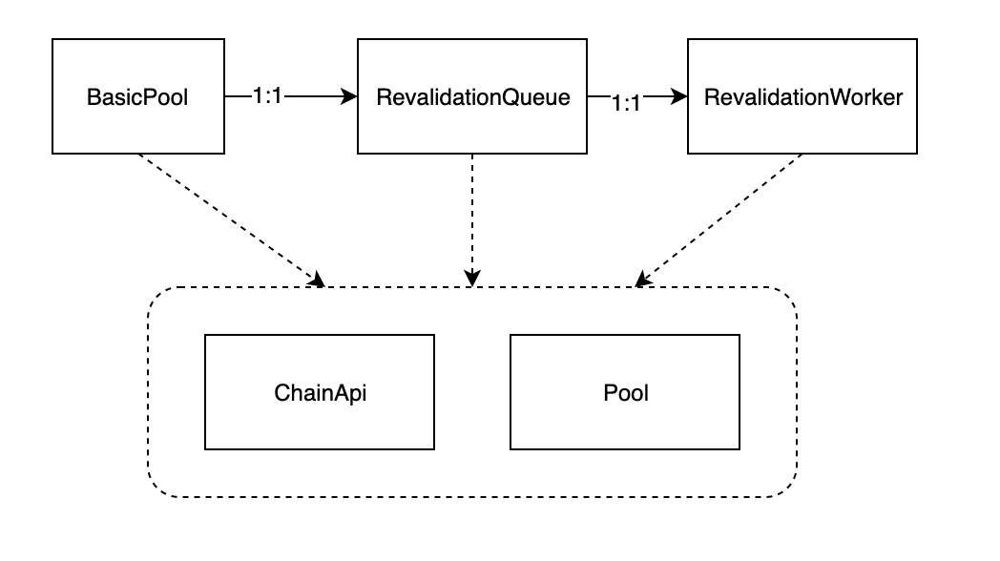

# 说明
Transaction-pool是系统使用的交易池，除了并管理无状态的交易（比如说发送一条转帐命令）之外；交易池还管理有状态的交易，有状态的交易是指可以需要某个条件后到达（比如说区块号大于多少）才能够生效的交易。

系统通过几个xxx_at（例如submit_at,validate_at)实现有状态的交易，另外通过Tag属性来进行交易的状态化。Tag是指交易有效之前需要的标识。  

有了这套体系，可以方便地实现需要状态的交易，比如投票需要等到某个区块到达后才可以开始，委员会选举的reveal阶段需要等到最低投票人数到达后才可以开始等。

transaction-pool是非常重要的一个类，这个类的理解对于整个substrate是如何驱动运转的会有很大的帮助，因此在本文详细介绍各个目录、文件、模块甚至是实现函数。

我们按照transaction-pool目录下的各个文件分开说明

# src目录下的类说明
src目录下除了`error.rs`之外，主要提供了三个文件：
1. `lib.rs` 基本的类说明文件，并且定义了几种pool类的接口以及basicpool类的实现；
2. `api.rs`定义了基本的ChainApi的接口，并且实现了`FullChainApi`和`LightChainApi`；
3. `revalidatetion.rs`：定义了一个`RevalidationWorker`,是Revalidate的工作线程。
## src目录下的模块结构
模块结构如下图：
  

BasicPool创建了一个RevalidateQueue，这个队列创建了一个后台的RevalidationWorker。
<span id="basic_pool">BasicPool用法之一：</span>
1. 实现`MaintainedTransactionPool`,监控链的NewBlock和Finalized两个事件，NewBlock事件时，调用：
   1. ready_poll处理需要在本区块处理的交易
   2. `revalidation_queue.revalidate_later`清除不需要的交易
## 基本类
### `BasicPool`
基本的交易池,里面包括五个属性字段：
```rust
{
    pool: Arc<sc_transaction_graph::Pool<PoolApi>>,
    api: Arc<PoolApi>,
    revalidation_strategy: Arc<Mutex<RevalidationStrategy<NumberFor<Block>>>>,
    revalidation_queue: Arc<revalidation::RevalidationQueue<PoolApi>>,
    ready_poll: Arc<Mutex<ReadyPoll<ReadyIteratorFor<PoolApi>, Block>>>,
} 
```
pool：实际存储交易的交易池
api： 一个PoolApi对象,用于对外供api接口
revalidation_strategy： 重新验证的策略
revalidation_queue：重新验证的队列（详情见[Revalidation](#repla)。
ready_poll：一个可以被多个线程调用的`ReadyPoll`对象

BasicPool提供了如下的接口
#### 创建

```rust 
pub fn new(
        options: sc_transaction_graph::Options,
        pool_api: Arc<PoolApi>,
    ) -> (Self, Option<Pin<Box<dyn Future<Output=()> + Send>>>) {
```
创建一个BasicPool，其中:  
* <span id="options" > `options` </span>是Pool的配置，包括三种：
  * `ready` 限制ready队列
  * `future` 限制future队列
  * `reject_future_transactions`拒绝future交易  
* `pool_api`是一个PoolApi的对象     

new实际使用了[使用验证方案来创建](#span-id%22validate%22%e4%bd%bf%e7%94%a8%e9%aa%8c%e8%af%81%e6%96%b9%e6%a1%88%e6%9d%a5%e5%88%9b%e5%bb%baspan)创建了实际的对象
#### <span id="validate">使用验证方案来创建</span>

```rust 
    pub fn with_revalidation_type(
        options: sc_transaction_graph::Options,
        pool_api: Arc<PoolApi>,
        revalidation_type: RevalidationType,
    ) -> (Self, Option<Pin<Box<dyn Future<Output=()> + Send>>>) {
```
* `options`和`pool_api`的说明见[new中的options](#options)
* `revalidation_type`有两种，`Light`和`Full`

如果是Light，那么使用`new`创建一个`RevalidationQueue`，如果是Full，那么使用`new_background`创建一个`RevalidationQueue`和`background`线程，这个线程每200ms执行一次，详细执行见[revalidation](#span-id%22revalidation%22-revalidatetionspan)。
然后使用返回的`RevalidationQueue`和输入的参数来创建BasicPool对象。
#### 查询pool对象
```rust
    pub fn pool(&self) -> &Arc<sc_transaction_graph::Pool<PoolApi>> {
        &self.pool
    }
```

### `RevalidationQueue`
实现再激活功能的队列，具有三个属性：
```rust
pub struct RevalidationQueue<Api: ChainApi> {
    pool: Arc<Pool<Api>>,
    api: Arc<Api>,
    background: Option<mpsc::UnboundedSender<WorkerPayload<Api>>>,
}
```
* pool 交易池
* api  提供交易处理的api
* background 如果启动了后台线程，这个就是与后台线程通信的接口

#### 创建
创建有三种方法：
1. `new(api: Arc<Api>, pool: Arc<Pool<Api>>) -> Self {` 创建了一个默认的，没有自动工作后台线程的队列
2. `pub fn new_with_interval<R: intervalier::IntoStream>(
        api: Arc<Api>,
        pool: Arc<Pool<Api>>,
        interval: R,
    ) -> (Self, Pin<Box<dyn Future<Output=()> + Send>>)` 创建一个具有后台线程，并且指定每interval与后台交互一次的队列
3. `pub fn new_background(api: Arc<Api>, pool: Arc<Pool<Api>>) ->
        (Self, Pin<Box<dyn Future<Output=()> + Send>>)` 创建一个具有后台线程，每默认时间（200ms)与后台交互一次的队列
#### 延时激活
异步的，对一组交易实现再激活的函数，如果：
1. 队列有后台再激活线程，直接返回（再
2. 队列如果没有再激少后台线程，等到实际工作执行后再返回
`fn revalidate_later(&self, at: NumberFor<Api>, transactions: Vec<ExHash<Api>>) {`
注意，参数中的transactions是交易的哈希值，这意味着这个函数是对交易池内现有的交易进行再激活处理
### `RevalidationWorker`
异步验证交易的的工作线程，实现了可以直接或是放在后台进程中使用的的future
```rust
struct RevalidationWorker<Api: ChainApi> {
    api: Arc<Api>,
    pool: Arc<Pool<Api>>,
    best_block: NumberFor<Api>,
    block_ordered: BTreeMap<NumberFor<Api>, HashSet<ExHash<Api>>>,
    members: HashMap<ExHash<Api>, NumberFor<Api>>,
}
```
* api是chainapi的对象
* pool是交易池
* best_block是当前最好的区块
* block_ordered：根据每个区块高度放置的交易信息
* members：根据交易哈希查询应该在哪个高度有效

## 辅助类
### TransactionPool特质
BasicPool实现了TransactionPool特质。
#### submit_at
```rust
fn submit_at(
        &self,
        at: &BlockId<Self::Block>,
        source: TransactionSource,
        xts: Vec<TransactionFor<Self>>,
    ) -> PoolFuture<Vec<Result<TxHash<Self>, Self::Error>>, Self::Error> {
```

####  submit_one
```rust
fn submit_one(
        &self,
        at: &BlockId<Self::Block>,
        source: TransactionSource,
        xt: TransactionFor<Self>,
    ) -> PoolFuture<TxHash<Self>, Self::Error> {
```
#### submit_and_watch 

### `ReadyPoll`
`ReadyPoll`记录了在某个区块上需要查询数据的`poller`，其结构如下：
```rust 
struct ReadyPoll<T, Block: BlockT> {
    updated_at: NumberFor<Block>,
    pollers: Vec<(NumberFor<Block>, oneshot::Sender<T>)>,
}
```
* `update_at`是记录当前对象在哪个区块上被执行了，执行是指trigger函数被调用了；
* `pollers`记录了在哪个区块上需要执行，然后执行后的数据接收者。

`ReadyPoll`对外提供三个接口：
1. `trigger(&mut self, number: NumberFor<Block>, iterator_factory: impl Fn() -> T)`:这是一个执行函数，在某个区块上可以通过执行这个函数来对需要在number区块以前的所有的poller都执行一次清理。
2. `add(&mut self, number: NumberFor<Block>) -> oneshot::Receiver<T>` 向ReadyPoll对象添加一个poller
3. `updated_at(&self) -> NumberFor<Block> `这个ReadPoll的最新执行的区块高度

### `RevalidationType`
### <span id="revalidation"> `revalidatetion`</span>
`revalidation.rs`文件里是与验证有关的特质和结构类型：
#### `WorkerPayload`
这个表征了工作线程的工作任务
```rust
struct WorkerPayload<Api: ChainApi> {
    at: NumberFor<Api>,
    transactions: Vec<ExHash<Api>>,
}
```
* `at`是需要在哪个区块上进行执行
* transactions是在该区块上需要重新validation的交易


#### 创建
#### 批量再验证
根据链的情况，对pool中所有的交易进行验证，无效的移除，有用的重新放进交易池
```rust
async fn batch_revalidate<Api: ChainApi>(
    pool: Arc<Pool<Api>>,
    api: Arc<Api>,
    at: NumberFor<Api>,
    batch: impl IntoIterator<Item=ExHash<Api>>,
) 
```
* pool是交易池
* api是提供验证接口的api
* at 是区块高度
* batch 是一组待再验证的交易哈希


## 实现的特质
BasicPool实现了两个最主要的特质：
* `TransactionPool` 最基本的交易池的接口实现
  * `submit_at`  提交一组在某个区块后生效的的交易
  * `submit_one` 提交一个在某个区块后生效的的交易
  * `submit_and_watch` 提交一个在某个区块后生效的的交易，并且返回一个监视器
  * `remove_invalid` 清除当前交易池内无效的交易，返回这些被清除的交易
  * `status`  返回交易池的状态
  * `import_notification_stream` 注册一个交易被导入到交易池时的通知事件
  * `hash_of`  根据交易查询对应的哈希
  * `on_broadcasted` 通知交易池，某些交易已经被传播（交易池中需要更新交易的状态，是否被传播过也是一种痒）
  * `ready_transaction`  某交易是否已经就绪，如果未就续，返回None
  * `ready_at` 这个将返回一个future,在某个区块时有效的交易
  * `ready` 返回当前区块时，已经就绪的交易
* `MaintainedTransactionPool`这个特质自动处理区块的两个事件，NewBlock区块和Finalized事件，在事件到达时，对交易池作一些处理（见[BasicPool用法之一](#basicpool))的说明


# graph/src下的文件说明
graph是交易池的实现细节，为什么使用graph名字呢，是因为交易在交易池中是以[图的形式]()存在的。

## base_pool.rs
base_pool.rs是是BasicPool中的pool属性和transaction的实现，在base_pool实现了两个最重要的类：
1. Transaction： 在池中的交易信息
2. BasePool： 注意不是BasicPool，BasicPool在src目录中，主要是对外提供接口，BasePool是实现交易的存储和管理池。

### Transaction
```rust
#[cfg_attr(test, derive(Clone))]
#[derive(PartialEq, Eq, parity_util_mem::MallocSizeOf)]
pub struct Transaction<Hash, Extrinsic> {
    /// 代表了交易的原始的extrinsic
    pub data: Extrinsic,
    /// 交易编码后的大小
    pub bytes: usize,
    /// 交易的唯一哈希
    pub hash: Hash,
    /// 交易的优先级，值越大越高
    pub priority: Priority,
    /// 交易有效的区块
    pub valid_till: Longevity,
    /// 交易依赖的前提Tag
    pub requires: Vec<Tag>,
    /// 这个交易能够提供(所产生的）的tags
    pub provides: Vec<Tag>,
    /// 此交易是否应该被传播（广播到其他节点）//Should that transaction be propagated.
    pub propagate: bool,
    /// 交易的来源（InBlock/Local/External)
    pub source: Source,
}
```
从上述的Transaction定义可以看出，此处定义的交易是有状态的交易，除了原始的交易信息之外，还包括了交易的其他信息。

Transaction其实代表了已经被纳入交易池的交易，因此它实现了InPoolTransaction的特质
* InPoolTransaction特质 
  * data:         返回交易的extrinsic数据
  * hash:         返回交易的哈希值
  * priority:     返回优先级
  * longevity:    返回生命周期（失效的区块高度）
  * requires:     返回依赖条件
  * providers:    返回产生的tags
  * is_propagable:返回是否需要传播

Transaction同时还实现了
* AsRef 特质，可以把Transaction当前一个Extrinsic返回
* Clone 特质，可以实现Transaction的克隆
  
### BasePool
实现了所有交易的<span id="depend_graph">依赖关系图</span>，并且返回那些已经就绪的交易。 注意，一旦某个函数返回了一些交易，这将意味着重新导入这些交易会失败或者产生一些非期望的结果。在大部情况下，我们需"再激活"它们并且重新计算依赖关系。
```rust
#[derive(Debug)]
#[cfg_attr(not(target_os = "unknown"), derive(parity_util_mem::MallocSizeOf))]
pub struct BasePool<Hash: hash::Hash + Eq, Ex> {
    //是否拒绝未来的交易
    reject_future_transactions: bool,
    //未来的交易
    future: FutureTransactions<Hash, Ex>,
    //已经就绪的交易
    ready: ReadyTransactions<Hash, Ex>,
    /// 保留最近丢弃的tags (最近两次调用所丢弃的).
    ///
    /// 这是为了保证我们不会意外把需要这些tags验证的交易放到future里去。
    recently_pruned: [HashSet<Tag>; RECENTLY_PRUNED_TAGS],
    recently_pruned_index: usize,
}
```
#### 创建
`pub fn new(reject_future_transactions: bool) -> Self {`  
创建一个BasePool

#### 临时允许未来交易
`pub(crate) fn with_futures_enabled<T>(&mut self, closure: impl FnOnce(&mut Self, bool) -> T) -> T {`  
临时使能未来的交易，然后运行closure后，恢复reject_future_transactions，并且将closure的结果返回

#### <span id="import">导入</span>
`pub fn import(
        &mut self,
        tx: Transaction<Hash, Ex>,
    ) -> error::Result<Imported<Hash, Ex>> {`  
把某个交易导入进交易池，注意交易池中包括两个部分：未来的和已就绪。前者包括一些需要依赖尚未被其他交易提供的标签的交易。后者包括所有的条件已经满足的交易，可以被区块包含了。  
导入过程首先使用当前ready和最近被抛弃的tags来对导入的交易运行`WaitingTransaction`，然后判定该交易的状态，如果是ready，进入就绪态，否则进入future态。当然还有一种可能，就是无效的，直接丢弃了。

#### 导入到就绪态
`fn import_to_ready(&mut self, tx: WaitingTransaction<Hash, Ex>) -> error::Result<Imported<Hash, Ex>> {`  
这是非公开的接口，被[导入函数](#span-id%22import%22%e5%af%bc%e5%85%a5span)使用

#### 获取就绪态的交易
`pub fn ready(&self) -> impl Iterator<Item=Arc<Transaction<Hash, Ex>>> `

#### 获取future的交易
`pub fn futures(&self) -> impl Iterator<Item=&Transaction<Hash, Ex>> {`

#### 根据哈希获取交易
`pub fn by_hashes(&self, hashes: &[Hash]) -> Vec<Option<Arc<Transaction<Hash, Ex>>>> {`  
根据提供的哈希返回对应的交易，无论交易处于就绪态还是future态。 注意返回的是一个Vec<Optio<...>>，因此返回值总是与hashes长度一样（每一项要么有交易，要么是个None)

#### 根据哈希获取就绪态的交易
`pub fn ready_by_hash(&self, hash: &Hash) -> Option<Arc<Transaction<Hash, Ex>>> {`
与`by_hashes`的区别就是只获取就绪态下的

#### 交易限制确认
`pub fn enforce_limits(&mut self, ready: &Limit, future: &Limit) -> Vec<Arc<Transaction<Hash, Ex>>> {`  
从交易池的队列中删除最差的交易以及依赖这些最差交易的其他交易。 从技术上说，最差的交易需要通过计算整个pending集才能够得到。此处使用的是最久未被处理的交易。此处的limit可以是两种类型之一：
* 交易个数：限制交易个数的总量
* 编码长度：限制编码后的数据长度

#### 删除交易子树
`pub fn remove_subtree(&mut self, hashes: &[Hash]) -> Vec<Arc<Transaction<Hash, Ex>>> {`  
删除指定哈希所指代的交易以及依赖这些交易的交易。返回被删除的交易，注意：
* 某些交易可能还是有效的，但是他们可能因为是区块的一部分所以被移除了，你可以在后面通过re-import来重新导入
* 如果你想要移除已经被使用的，处于就绪态的交易，并且不想让他们保留在存储池中，请使用`prune_tags`方法
* TODO 需要仔细咀嚼含义

#### 删除所有处于未来态的交易
`pub fn clear_future(&mut self) -> Vec<Arc<Transaction<Hash, Ex>>> {`


#### 修剪tags
`pub fn prune_tags(&mut self, tags: impl IntoIterator<Item=Tag>) -> PruneStatus<Hash, Ex> {`
根据所提供的tags，重新调整交易池中的交易，其实做了三件事：
1. 尝试把所有的依赖这些tags的交易提升到就绪态
2. 在就绪态中删除提供这些tags的交易（自身）
3. 在recently_pruned中记录这些tags
最后返回结果的状态(删除的交易，失败的交易，从future到ready的交易)

#### 交易池状态
