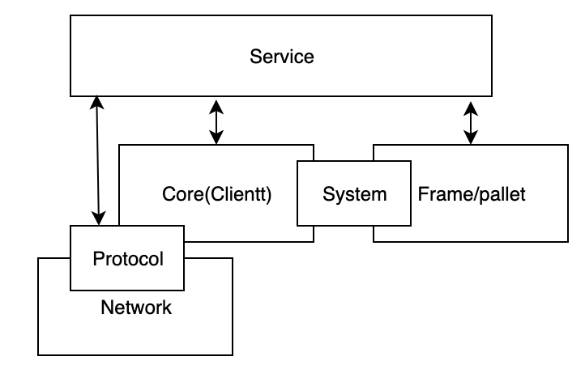

# 概要描述
   这是对substrate代码的综合理解，针对已经对substrate有一定了解的开发者。在查阅本文档前，请先仔细阅读[这篇官方文档](https://substrate.dev/docs/en/)，并尽最大可能先理解它。
   
   substrate框架分为三层：  
    
1. 最低层的是网络，负责节点的发现，连接的建立和消息的传递等基本的网络工作  
2. 网络层通过Protocol对外暴露接口，Procotol是区块的区块数据协议，比如说区块的导入和传播，交易的传播等，Protocol被设计成插件式的，把基本的区块链的一些动作抽象出来，可以配置不同的处理器来处理这些动作，从而方便地实现定制化  
3. 在网络层之上是Core(Client层)，这一层管理区块的生成、验证、链的导入等工作，凡是和区块生成有关的处理，应该放在这里。或者说这里是链下的工作，比如说区块的导入，是从数据库里或是其他节点上读取数据，然后更新状态信息，即使这个节点不具有出块功能，也可以完成这些工作。 这里生成的对象实例，可以被Protocol组合，以实现链的定制  
4. 再往上一层是Pallet（托盘），其实是各个功能模块，这里面是处理区块内部的内容的，比如说某个交易处理，然后更新帐户余额信息。  
5. System接口是Pallet与Core部分的接口。  
6. 如果一个模块，既影响区块的生成，又影响区块内部的交易，就需要同时在Core和Pallet中实现。 当然，在Core中实现与区块生成有关的代码，在Pallet中实现与交易相关的代码。  

# Core/Frame实现内容的进一步说明
1. 所有需要在链上验证的，都应该在Frame实现
2. 不需要链上验证的，应该在Core中实现  
**使用Aura共识举个简单例子：**  
区块的生成在Core中，但是区块中的authority_id和timestamp的处理是在Frame中，因为你如何生成，通过什么方式生成，还是是通过什么语言生成，链上的节点并不关心，但是链上的节点关心authority_id是否有效，timestamp是否在允许的范围内。  
3. 另外需要注意的是，如果我们在链上存储数据，由于链上数据是需要被验证的，因此如果是某个模块具有存储链上数据需求，这一部分也需要放在Frame中实现。   
**例子：authority_discovery**  
Aura使用了预置的AurtorityIds，在每个session/Epoch开始时，计算得到各个Slot的Authority，并且记录在链上。 AuthorityDiscovery为Aura实现此功能，因此该模块在Frame中有实现存储的部分。
 
 或者，我们可以换一种方法表达，Core中完成出块逻辑，这个逻辑包括：创建一个区块，导入一条链、分叉如何合并等，是对链的处理。而Frame中的完成验证逻辑：交易是否有效？执行完成后的状态是什么等。是对区块的处理。

 # 外援（Extrinsc）
 在substrate中，交易被称为外源，名称更换的原因有两个：
 1. 区块中打包不仅仅是资产交易，还可能包括一些其他的信息，比如说投票信息，在我们的扩展系统中，还包括存储证明信息等，通过这个方式，可以将一些以前在以太坊中，必须使用合约的功能放到主链上执行