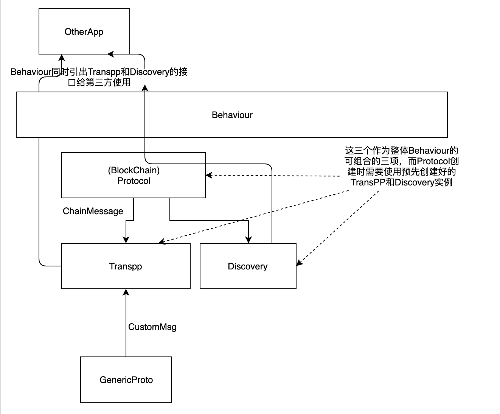

# 数据收发流程


需要使用notification的，使用如上的方式进行数据传输。

1. 首先通过register_notificaitons_protocol把自身注册到notification处理器中

2. 使用 
   ```rust 
   network.event_stream().filter_map(|e| async move { match e {
       Event::Dht(e) => Some(e)
   }})
    ```
    1. network_service.event_stream()创建一个新的（tx,rx)对，然后向把tx推送给networker,返回rx
    2. networker里有一个event_streams，记录所有的tx
    3. 当需要发送数据的时候，向event_streams中所有的tx发送数据
    4. 所有监听rx的都可以收到消息，过滤消息给自己需要的使用（使用poll)

## 不使用notification方式
不使用notification的方式时，可以使用SendLegency的方式进行，把notification的方式留给更上层的应用。

## Transpp和区块链protocol协议的处理

目前这个模式是最容易实现的模式，另外还有两种模式
1. transpp作为使用notifiation机制接入GenericProto
2. transpp作为GenericProto中与legency/notification平级的实现

通过目前的实现方式，我们可以为应用层提供三种形式的接口：
Legency：向邻节点发送"裸"数据
Notification:向邻节点发送"protocolId/ConsensusId/Data"类型的数据
Transpp：向网络中任意一个（组）节点发送数据

## Discovery API
DiscoveryAPI向应用提供PUT/GET Value， Start/Get Provider的功能

## 分组设计
通过DiscoveryAPI，可以控制节点加入或离开某个组的功能，其方法就是Start/Get Provider，通过Start Provider可以加入到某个组中，通过Get Provider可以获取某个组的节点信息

在应用系统中，节点加入某个组之后，由于服务能力有限，有可能会限制对某些节点提供的服务，最典型的就是在直播网络中，由于带宽的限制，节点可能会不接受新的连接请求，要实现这种模式，需要在应用层作状态管理，然后监控NotifsInHandlerOut::OpenRequest消息，并且对该消息返回Accepted或者Refused消息

目前在handler/group中，仅仅是判定当前是否为enabled，如果是，就直接Accept了。这个在实际的应用中是不够的，实际上，我们需要：
1. 在一个连接上开多个子流，
2. 每个子流根据特定的条件允许是否连接
3. 如果所有的子流都关闭，连接关闭  
第一和第三项目前的代码中已经完成，第二项需要作另外的处理。处理的方案如下：
1. 创建一个CheckAcceptable的trait
2. 创建register_notif_protocol的时候，把CheckAcceptable的一个实例作为参数传入
3. group在处理NotifsInHandlerOut::OpenRequest时，根据CheckAcceptable的结果决定是Accept还是Refuse
4. 应用层根据自身的应用逻辑实现CheckAcceptable
```rust 
    pub trait CheckAcceptable {
        fn IsAcceptable(vec<u8>);
        fn OnConnected(peerId,vec<u8>);
        fn OnDisconnected(peerId);
    }
```