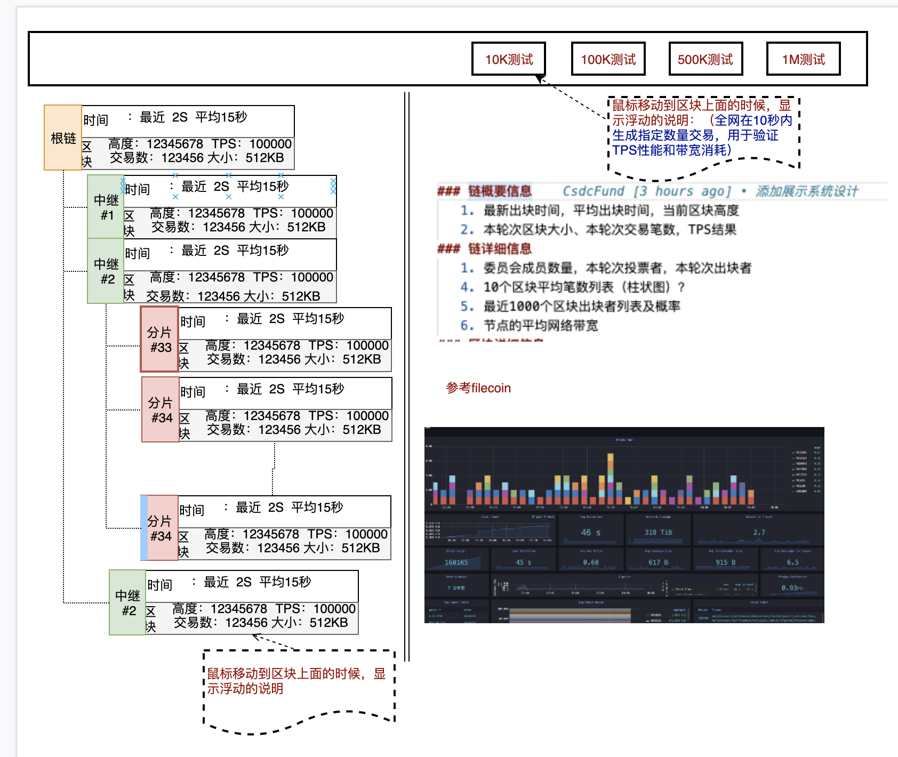
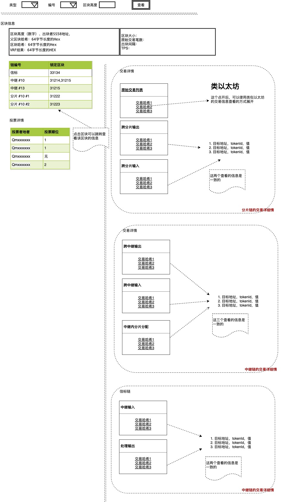

# 说明
总共需要分成两大块：展示和测试，展示是显示链的运行状态，测试是操作者可以自主做一操作，以表明数据是真实的而不是假的。注意，测试系统中包含两条测试链，一条是只有一个分片的链，另外一个是具有1024个分片的链。前者用于展示单分片的性能，后者用于展示多分片链的性能指标。这是由于在测试系统中，节点数量不足而采取的措施。

展示有三个部分：
1. 单分片展示  
  单链是模拟正常运行时一个链的运行状态，即系统中仅有一条信标链，一个中继链和一个分片链的效果，单个分片链内的节点数量不少于1000个，从而可以表示出在实际正式链上单个分片的运行状态
2. 分片链展示  
   分片链是模拟具有1000个以上的分片运行时的状态，即系统中有一条信标链、32个中继链和32个分片链运行的效果，在测试系统中，单个分片链内的节点数量只有4-10个，主要用于展示整个分片系统的性能
3. 钱包（节点）信息展示
   钱包（节点）信息展示该了某个节点的运行状态，包括地址、总抵押量、总存储量、出块情况、交易情况等

而测试部分是同样的包括单链测试、分片链测试和钱包（节点）测试。

# 展示
## 链信息展示
### 链概要信息
   1. 最新出块时间，平均出块时间，当前区块高度
   2. 本轮次区块大小、本轮次交易笔数，TPS结果
### 链详细信息
   1. 委员会成员数量，本轮次投票者，本轮次出块者
   4. 10个区块平均笔数列表（柱状图）？
   5. 最近1000个区块出块者列表及概率
   6. 节点的平均网络带宽
### 区块详细信息
   1. （区块高度（数字）、出块者SS58地址；父区块哈希：64字节长度的Hex；区块哈希：64字节长度的Hex；VRF结果：64字节长度的HEX）
   2. 投票结果详情（投票者、投的优先级，投票者为49或是99个）
   3. 当前区块锁定的其他区块（信标链中锁定了中继链的，中继链锁定了信标和分片链，分链链中锁定了中继链）
   4. 对于分片链，有如下的详细信息
      1. 当前区块处理的原始交易哈希列表，是（交易哈希）列表
      2. 当前区块处理的原始交易产生结果的哈希列表：格式为（目标中继，哈希）
      3. 当前区块处理的跨分片交易请求的哈希列表，格式为：（来源中继序列号，哈希）  
        **原始数据展开**  
         （i)中的哈希点开后，（目标地址/tokeid/value/参数)的的交易信息
        （ii）和(iii)中的哈希可以点击，点击后可以看到一组(地址、tokenid,值)的列表，表示每个地址需要增加的数字资产
     
   5. 对于中继链，有如下的详细信息
      1. 处理后需要发送到其他中继的哈希列表（目标中继，哈希）
      2. 处理后的结果哈希列表（目标分片、哈希）  
      **原始数据展开**  
        (i)和（ii）中每一个哈希点开后，是下一层的（目标地址，token,值）的列表,表示每个地址需要增加的数字资产
  
##  多分片链展示
### 需要展示的内容：

1. 总体需要展示的
   1. 按信标链打开折叠中继链
   2. 按中继链打开折叠分片链
2. 无论信标链打开中继链与否，都可以看到单链信息里（属于信标链）的概要信息
3. 当信标链打开后，看到32个中继链，可以看到32个中继链的概要信息：
4. 当打开某个中继链时，自动折叠其他的中继链（同一时间只打开一个），可以看到该中继链下的每个分片链的概要信息：

### 展示的说明
1. 页面分为左右两栏，左边的栏采用可折叠列表的形式；右边的采用图表或是数据的形式
2. 当点击左边某个项时，不仅展开或关闭对应的子项，右边打开这个链的最新的链详细信息（该链标识：信标、中继（包括序列号）还是分片（包括序列号）
3. 右边的信息中，上半部分是链的详细信息，下半部分是区块详细信息，默认是不打开的。可以设置链标识（信标、中继（序列号）、分片（包括序列号）），然后点击"查看区块详情"，就展示区块的详情。
4. 当点击左边的链时，右边将自动填充标识位，这样"查看区块详情"默认就是该链的最新区块信息。
5. 用户可以手工选择链标识，输入区块的高度，然后查看某个特定区块的详情

## 单分片链展示    
单分片链的展示方案和结果与多分片链是一致的，只是因为只有一个分片和一个中继链，因此默认把三层都打开。

## 钱包展示
钱包展示第一步不做设计，使用现有的substrate的客户端

# 测试功能
1. 在单分片链中，具有1k测试，2k测试，5K测试和10K测试功能，分散让节点总共产生1000-10000条交易然后提交到链上，测试者查看交易的完成情况和平均TPS，网络带宽等信息。
2. 在多分片链中，具有10K测试/100K测试/500K测试和1M测试，分别产生1万到100万交易，然后测试者观察交易的完成情况、平均TPS，网络带宽信息等各种性能指标
3. 我们做锁定和密码功能，当系统在测试中时，锁定按钮状态为测试中，直到测试结束后恢复。如果高TPS的测试，需要密码，防止我们想要测试的时候，被其他人测试了。
4. 在测试过程中，用户可以使用自己的钱包手动发送交易，进一步验证系统的正确性。
5. 用户可以自行创建钱包和一个全节点加入到网络中，这部分信息的展示在现有的substrate上面完成，不再这个展示系统里讨论。

# 效果参考
## 链信息查看

## 区块详情
