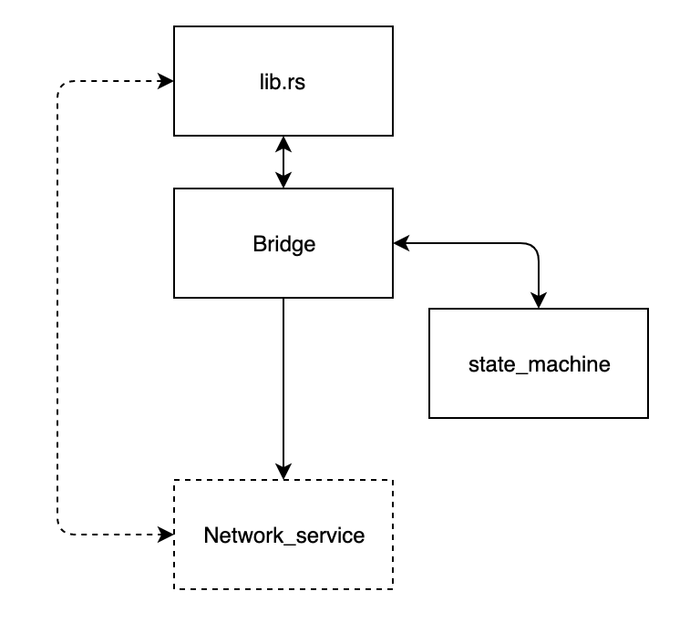

# 说明
TransPP是用于实现push/pull的数据发送器,具有三个文件
* bridge.rs TransPP的主接口，对外提供接口，与network接口对应，数据的存储和处理逻辑在state_machine中
* state_machine.rs 数据的存储和管理
* lib对外提供的接口，同时定义一个network的特性，后续可以实现此特性进行模拟测试
   

系统中应该只有一个transpp的实例，然后应用使用这个transpp的实例