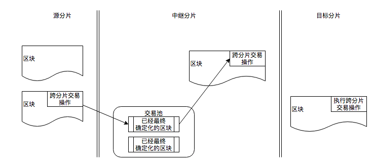

# 说明
在pnyx中，有大量的需要跨分片处理的交易，例如： 如果帐户Alice向Bob转移一笔资产，需要在Alice帐户中减去，然后在Bob帐户加上相应的值，在分片系统中，帐户alice和分属于两个不同的分片，要实现转帐的效果，需要做到以下的原子性：如果从Alice中扣除了资产，必须保证Bob中肯定能够收到资产；反之，如果从Alice中扣除失败，则肯定不会向Bob增加相应的资产。  
在实现上Alice所在的分片是无法也不应该关心Bob是否收到资产的，否则就会导致分片之间耦合性过强使系统无法工作。在Pnyx中，相应的处理方案是使用跨分片动作Cross-shard-actions，即需要跨分片处理的的动作，在原分片区块处理结束后，作为处理结果存放在区块体里，并且将对应的哈希放在区块头上。其他处理该区块的链，把这个区块看成是输入，然后处理区块体里的Cross-shard-actions。

# 跨分片中间结果的生成方式
中间结果生成有三种处理方式；
* 一种使用类似事件的方式进行，即提供接口给pallet，然后pallet中需要跨分片执行的中间结果，使用此接口记录需要跨分片交易的信息。  
* 另外一种方案使用返回值，我们设计一个跨分片中间类型，Call如果需要有跨分片执行的数据，就返回一个此中间类型； 
* 第三种方案，临时方案：增加一种内存中的数据存储模块，这个数据模块提供存入和取出两个接口，需要跨分片交易的操作，执行过程中将中间结构存到这个数据模块中。
* 
无论使用哪一种方式，Executive都需要在on-finalize时，收集这些记录。然后生成结果放到区块体里，然后将对应的哈希填充到区块头。由于
1. 第一种方式需要使用和修改现有的宏系统，实现新的保留函数，保留函数的定义见[此处](../../../Substrate代码研究/substrate框架/区块执行过程分析/dispatch.md)，
2. 第二种方式需要更新DispatchOutcome： 
    在目前的Callable的系统中，Applable中返回的`DispatchOutcome`是 `Result<(), DispatchError>`形式，因此我们需要做以下和工作；
    1. 定义一个跨分片交易的类`Intermediate`
    2. 更新`DispatchOutcome`的形式为`Result<Option<Intermediate>, DispatchError>`
    1. 所有的Extrinics执行后，收集`DispatchOutcome`的结果,然后根据此结果分类打包
    2. 分类打包后，数据本地存储，生成哈希(CID),在P2P系统中存储<CID，哈希>对。
3. 第三种方式需要附加一个模块

我们认为第二种方式是合理的具有任意可扩展性的方式,但是系统中使用了DispatchInfo来执行PostInfo，计算诸如部分交易重量的数据，因此选择的方案综合了1和3，具体如下：
1. 在System模块中添加一个存储项目，存储所有的跨分片交易的action
2. 提供保留函数generate_csa，可以将一个actionItem保存到存储项目中
3. 提供保留函数group_csa，这个处理是在finalize时候进行的，按照（分片、中继）分组存储项目中保留的actionItem，原始数据写入p2p存储器，哈希值记录
   1. 分片对原始交易的处理 group_raw_csa_of_shard
   2. 分片对中继交易的处理 group_relay_csa_of_shard
   3. 中继对分片交易的处理 group_shard_csa_of_relay   
   5. 中继对信标交易的处理 group_beacon_csa_of_relay
   6. 信标对中继交易的处理 group_relay_csa_of_beacon
   注意：原始的交易需要被写入P2p存储系统
数据参考：

# 详细设计

## 实现过程
在substrate中，区块的处理实现分成三个部分：
1. 区块结构的抽象，在这里抽象了区块头、区块体、区块交易以及实现相应的Callable和Applyable的接口，这个在primitive/runtime中定义，在这其中
   1. src/trait是区块有关接口的定义，以及类型约束
   2. src/generic/*是通用区块的一种抽象实现，更简单的实现可以直接参考 src/testing
2. substrate中的区块实现抽象，主要定义了本系统实现所需的的数据类型约束，这个在 frame/system中
3. 用户真正的实现，这个在node_template的runtime中

上述描述有点容易混淆，简单说，就是逐步从抽象到具体的过程，使实现者可以任意选择从某个层开始来定制自己的区块链。 要理解一个可执行交易（外源）的执行过程，请[查看这里](../../../Substrate代码研究/substrate框架/交易的执行过程.md)。

