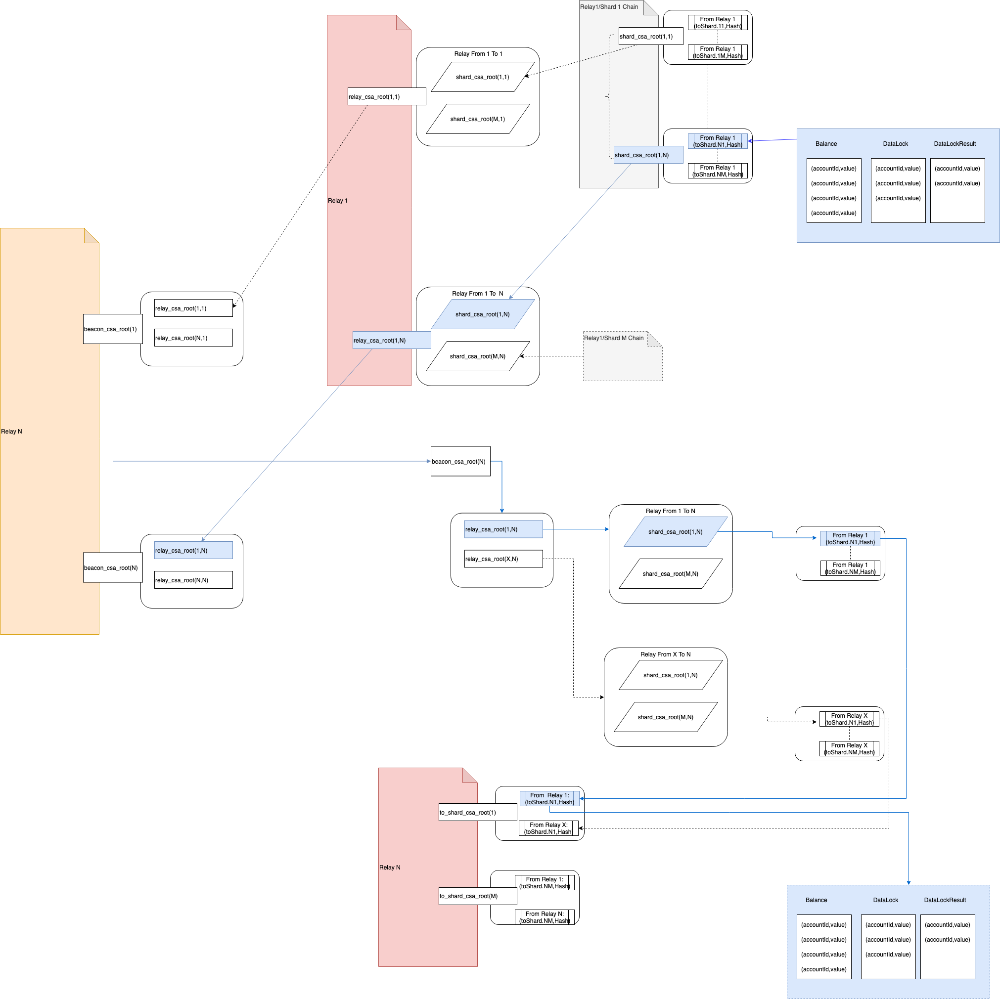

# 说明
每一条操作命令都有可能产生跨分片交易，这时候的目标总是最终需要执行这个交易的分片（或是某个链）。而为了实现最优化数据传输，有些数据并不需要暴露给本区块的消费者，本区块的消息者是把把本区块当成交易的链。因此我们在区块创建的最后一步，需要对这些跨分片交易的按照接收方所关心的方式进行处理，再打包进区块。  
因此在区块生成或是验证过程中，也分成两步：
1. 执行每条交易时，生成一个ActionItem，存储到一个管理池里
2. 在区块完成的时候，根据区块类型，重新分类整理这些ActionItem生成最终的结果

因此，我们需要：
1. 罗列所有的ActionItem的记录
2. 分组处理后的ActionItem管理器

由于不同类型的区块所执行的跨分片交易合并方式不同，因此还需要：
1. 可配置的ActionItem分组方案

# 数据类型
数据会分多个层次打包
1. 原始的ActionItem（目标地址，操作）
2. 以目标分片分组后的，这个分组以操作类型进行分类，然后再以目标分片为单位进行分组。
（分片->哈希或是{操作类型,Vec<ActionItem>})
这个结果可能是哈希或者是数据，如果是哈希，数据需要存放到P2P存储中备用，使用哈希还是直接数据的差别就是数据包是否大于某个值，目前初步定为1024字节。

3. 根据要求将按要求分片后的内容分组，这个是一般是从分片到中继，中继到信标

## 分层说明示意
下图是分片、中继和信标链数据结构的示意图

图中蓝色的部分是跨分片交易被各个角色处理的过程。

# 处理过程说明
