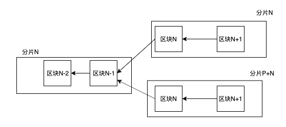

# 前言
pnyx使用了全分片系统，因此不同的节点所对应的数据不同，而弹性分片将导致一个节点在不同的区块时，属于不同的分片，下图是分片弹性扩展的过程：

当系统中的分片从P扩展到2P时，原来编号为N的分片将分成两个N和P+N。可以看出，有一部分节点还在N中，另外有一部分节点移动到P+N中去。节点应该在哪个分片中，与它们的地址有关， 节点所在分片的计算方式是：  
`chain_id = node_addr[:-4] & chain_shard_exp`，  
其中: 
* `node_addr[:-4]`表示节点地址的后4个字节
* `chain_shard_exp`是分片数，其值由ShardExponent中的relay和shard决定，算法为chain_shard_exp = 2  relay+shard-1

以上示例的链，我们称为在区块N高度上进行了分片扩展, 对于过去的区块，可能已经发生过多次的分片扩展；对于未来的扩展，可能需要在某个区块上进行分片扩展。因此我们需要一个关于分片扩展的历史记录，从而得知当前区块的实际分片情况以及节点所在分片的位置。同样，不同的角色所在的分片号不同，比如说中继链节点总是在中继分片中，而信标链永远只有一个。因此，要得到节点当前所在的分片，我们需要以下几个信息（A）：
* 节点的角色
* 分片的过去和未来记录信息
* 当前链的高度
* 当前节点的地址

## 数据同步考虑
弹性分片是由信标链发起的，因此信标链总是记录了弹性分片的历史记录，由于信标链总是只有一条，是固定不变的，因此节点在同步的时候，可以考虑先从信标链上取得分片信息，然后再根据此分片信息，获取自身所在的分片。详细的过程说明，请参考[快速同步]()

# 分片信息的设计方案

由于所处分片值需要计算获得，Client在创建或是验证区块时，需要根据A中的4个信息获得区块的分片信息，当前链的高度和分片的信息在链上（Beacon或是本链）区取，而节点的角色和节点的地址需要通过配置传入。因此我们对于三种不同的链，需要创建三个ServiceBuilder，把相应的角色和地址传入。

在非分片系统中，只有在出块或是生成交易时，才需要将使用节点的地址，而在分片系统中，节点需要一直使用地址信息来确定自身所在的链信息，因此，最简单的方法是将地址信息也存储到数据中元数据信息中去。

信标链生成了分片指数信息，中继链节点处理分片指数信息，然后同样广播到分片链中，分片指数信息的处理有两种：链下处理和链上处理。链下处理是指数据节点里处理，其结果并不需要通过共识认证，每个节点处理后，更新自身的数据。链上处理是指处理的结果放入到世界树里，这样就可以经过共识处理并且被哈希锁定。  

无论是链上还是链下，分片指数信息的历史记录需要被保存，这样节点才能够通过此记录回溯自身在不同的区块高度时，所处的分片情况。由于[快速同步]()功能的存在，节点不是从最创世区块开始对所有的区块进行重放，而是从最近的快照开始，对此快照后续的区块进行重放。由此可见节点同步的数据是从某快照开始的，而快照就是一个世界状态树，世界状态树是由链上处理生成的，因此分片指数信息必须被链上处理。同时由于分片指数信息是需要被链下频繁使用的，因此我们也需要在链下快速访问，链下访问世界树状态并不是一个特别容易或是合适的行为，因此我们可以在链下为链上的分片指数做一个镜像。我们可以考虑多个方案来实现，第一种方案具体来说有两点：

1. 在同步快照的时候，需要将链状态树中的信息复制一份给链下
2. 链下同样处理DigestItem(ShardExp)中的信息，这样在收到DigestItem(ShardExp)的信息时，更新分片指数

这个方案有个问题：分片信息在链上和链下都保存，都有修改，这从设计上是有问题不可能接受的，两个数据的一致性无法得到保证。因此我们可以考虑方案二：
1. 分片指数信息数据总是从链下向链下复制
2. 链上把分片指数信息复制到链下两个时间点，一个是读取快照的时候，另外一个是处理DigestItem(ShardExp)
3. 链下永远只读取而不修改分片指数信息

* 在这个方案里，链下需要给链上提供一个更新分片指数信息的接口。

## 分片信息使用
在不同的时候需要使用分片信息，管理一条链具有三个部分：
    1. BlockBackend:  区块信息，根据区块ID取出区块体的内容
    2. HeaderBackend：最基本的链的信息，管理区块头的插入、删除、回滚信息
    3. HeaderMeta：   这个是区块头的元信息，在系统中为这个HeaderMeta做了一个缓存，可以用于在插入、回滚时的快速计算。  
在使用中，在以下几个场合需要使用到分片信息：
1. 生成区块时：生成区块的时候，需要生成相应的chain_id
2. 导入区块时：验证区块时，需要验证chain_id是否正确
3. 获取链的信息时：得到当前的chain等信息

   

## 分片信息存储

再次理解client和数据的存储关系：

Client节点的实例，实现了BlockBackend,HeaderBackend和HeaderMetadata等接口，实际上，Client对外实现这些接口就是简单地调用了self.backend.blockchain().xxx函数。我们对需要的数据分成两组，第一组是固定的，由配置或是外部启动时传入的，这部分的数据包括两个：
1. run_as 这个client是什么角色运行（Beacon/Relay/Shard)
2. account_id，这个client的节点地址

另外有一组数据是动态的：主要包括两个
1. 分片指数信息（需要包括历史信息）
2. 所属分片信息，所属分片信息需要通过区块高度、分片指数、角色和节点地址计算得到

如上节所述，分片的指数信息是需要通过链上的状态得到的，因此client需要提供一个给链上使用的接口， 因此我们需要为分片信息存储提供以下的接口：
1. Client提供一个给Runtime更新分片指数的api
2. HeaderBackend中提供根据BlockNumber获取ChainRole的接口get_chain_id(BlockNumber)，这个接口总是使用backend中的节点地址和run_as信息来区获取
3. 在返回的Info中，添加分片指数信息

### 提供给runtime api的实现
1. 定义一个Trait,提供给Runtime更新分片指数的API的接口
2. Client实现这个Trait
3. 链上API实现参考[这里](../../../Substrate代码研究/substrate框架/runtime运行时/1.总体说明.md)

