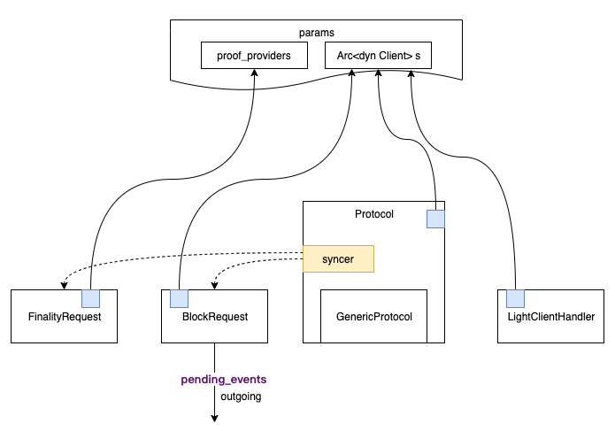

# 概述
网络层（client/network)中，最核心的概念是Protocol，Protocol代表了substrate所有的传输协议。除了protocol之外，还有一个LightClientHandler，顾名思义，就是轻客户端的通信协议，包括作为轻客户端和为轻客户端提供服务。  

network中各个通信模块的关系如上图所示，注意这里多了两个模块FinalityRequest和BlockRequest，这个是为Protocol提供证明和区块获取的辅助类。而Protocol里原来就有读取区块和最终证明的功能，这两个模块是新的协议，目前的实现中，新的和旧的读取方式代码都存在。

此处FinalityRequest/BlockRequest/Protocol/LightCilentHandler都是networkbehaviour。因此syncer是不能直接调用FinalityRequest和BlockRequest的，实现的调用方式是syncer在需要的时候，生成一个CustomMessageOutcome，然后在Behaviour在Poll的时候，转化成NetworkBeahaviourAction，这样就可以由BlockRequest/FinalityRequest模块进行处理。

上节所述的由BlockRequest(FinalityRequest)模块处理如下：
1. 生成了NetworkBeahaviourAction，被libp2p发送到了对端
2. 对端的behaviour在inject_event中，收到了CustomMessageOutcome::BlockRequest事件，调用self.block_request实例进行处理

# 数据同步问题

## 问题描述
数据同步需要解决以下几个问题：
1. 节点事件：只有同组的节点连接成功，才会产生new_peer事件
2. 握手：只有同组的节点才会握手
3. 同步节点：只和组内的节点进行同步动作，三个不同的角色对应了三个不同的同步器
4. 不同高度时候的chain_id可能有所所不同，同步的时候，需要进行处理
5. P2P存储缓冲区的问题（未来实现）
   由于同组的节点之间可能并不连接，因此数据可能需要经过其他节点转发，但是有些数据可能在其他节点上有，中间节点发现自己有这个数据的时候，可以直接返回给请求者，这样可以节省数量传输量。需要仔细规划协议以及如何与p2p存储连接

## 处理方案
数据同步分成两个层次处理：
1. 第一个层次是运行角色，即系统的run_as，因为每个节点上都运行了最多三个run_as，而在请求的时候，请求者自身知道需要从哪个角色链上区取，因此请求都会附加一个run_as字段，同样在返回时，为快速定位属于哪个角色链，因此在返回时也会附加run_as；
2. 第二个层次是链id，同步器(syncer)需要管理自已的链ID所对应的对端节点，然后从满足条件的对端节点上获取数据

## 附加说明
FinalityRequest和BlockRequest都是在behaviour层次上处理，因此目前只支持邻节点之间的通信，而syncer需要考虑到有可能需要同步数据的的两个节点并不连接，因此不能使用FinalityRequest和BlockRequest，需要使用GenericProtocol来实现。  

使用GenericProtocol的方案后，通过将send_request/send_message消息改成transp2p的相应的函数就可以。

