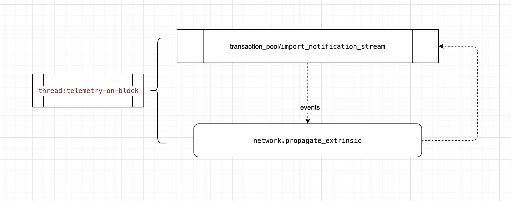

# 网络层协议
目前网络层协议大体可以分为四种：
1. block_announce，     传播新区块
2. extrinsic,           传播新交易
3. chain-sync related:  同步相关
另外为了支持grandpa，使用gossip创建了第四种协议  

# 链同步系统改造
链同步是由ChainSync对象来实现的，原有的系统中只有一条链，因此使用一个ChainSync对象就可以了，目前可能会需要多条链（担任某一个角色 信标/中继/分片）。我们的改造方案如下：
1. 担任一种角色，就需一个ChainSync对象
2. ChainSync对象中，添加地址share_exp信息以及计算获得chainid的函数

# 消息部分
## 投票消息
### 投票请求
投票请求总是发给委员会成员，委员会成员收到投票请求后，需要重新向委员会成员组广播，这个广播是具有延时广播功能的。延时广播可以避免候选人在不满足要求，任意发送投票请求来攻击网络。
### 投票结果
投票结果是单播，因此在中间的节点并不会得到这个消息，为了安全起见，每个节点收到投票结果时，需要与自身的地址比较，如果不是发给自身的，可以直接丢弃。
## 区块体消息
### 读取区块体
#### 读取交易信息
#### 读取交易信息反馈
#### 读取中间结果
#### 读取中间结果反馈

# DigesItem部分

# Extrinsic部分
Extrinsic消息是通过 transaction-pool来进行传播的  

# Message 数据结构
定义各种消息体以及消息头

