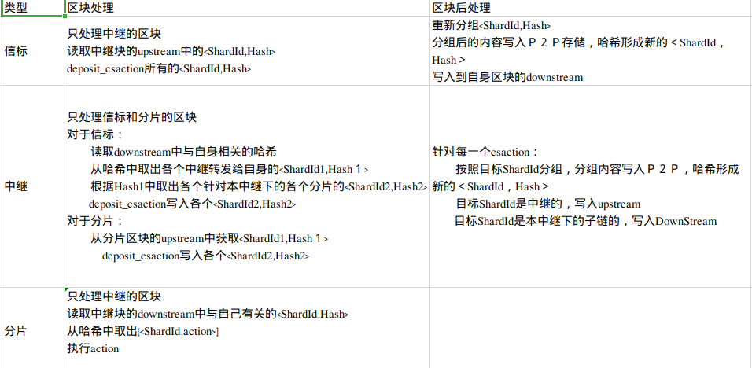

＃　概述
所有的跨分片交易处理，都分为两个阶段，
１. 每个需要跨分片交易处理成一个或一组<ShardId,Hash/action>对象
2. 对所有的记录的<ShardId,Hash/action>对象按照如下的方式进行处理：
   1. 如果ShardId是自身，执行对应的action，　否则
   2. 如果ShardId不是自身，根据目标进行分组，分组后的数据存入Ｐ２Ｐ存储，目标及对应的哈希进行CsaResult

# 区块处理详细过程

[excel 文档在这里](./block_as_transaction.xlsx)
