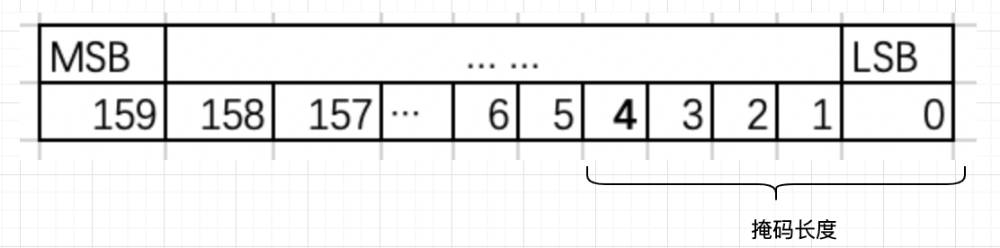
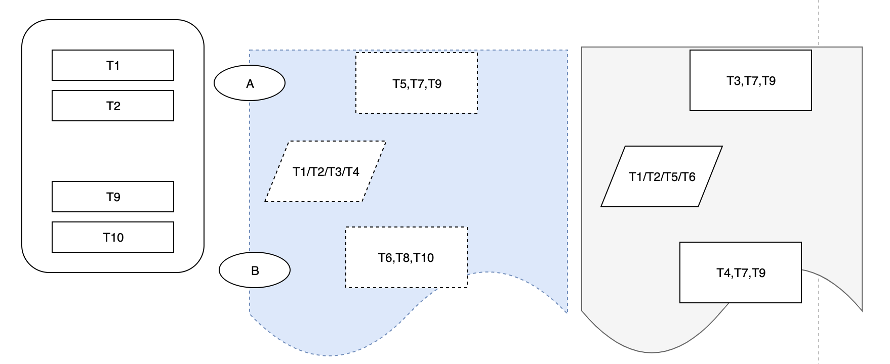
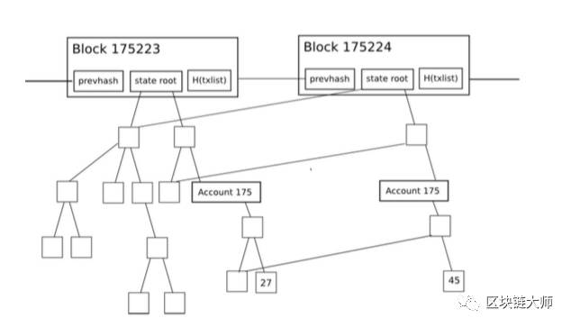
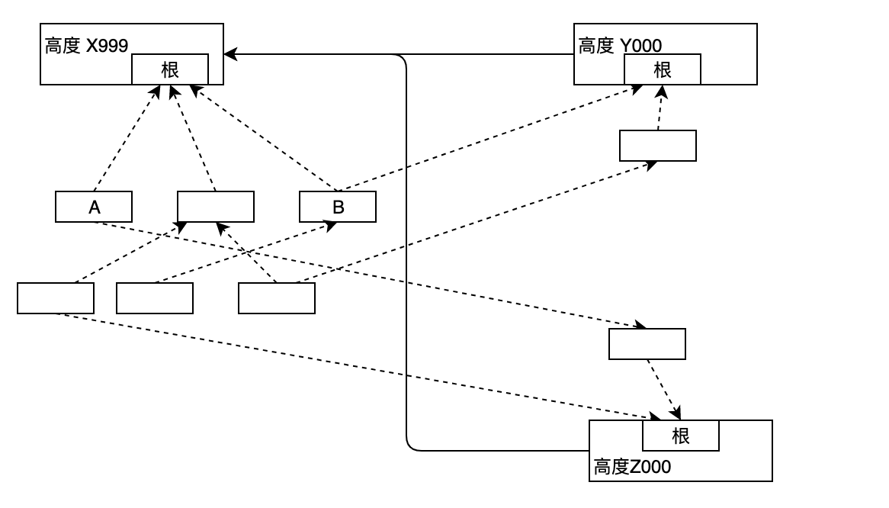

# 说明
本文档描述在如果Substrate上实现Pnyx算法的，实现高性能的分片区块链系统。Pnyx算法的描述和证明见[《Pnyx算法说明》](./../../Pnyx算法说明/cn/委员会竞选.md)。

本系列设计说明书将会按模块描述实现：
1. 创世区块及启动
2. 分片链及弹性扩展算法
3. 委员会选举算法
4. 区块设计
5. 出块算法
6. 跨分片合约

本文将会对以上所有的模块进行概要设计，然后每一个模块单独会有一个详细设计模块。此处的概要设计和详细都是依据在substrate上如何实现而编写的。  
# 创世区块及启动
在substerate中，创世区块的配置是通过genesis.config来实现，genesis.config是一个开放式的可以自由定义的JSON格式文件。每个pallet都可以自由读取genesis.config中的属性。在Pnyx中，需要配置以下的几个属性：
1. 可信节点： 是在启动的时候，可以默认的可信节点，可信节点默认是委员会成员
2. 委员会成员最小和最大个数： 每轮EPOC中可以选举出来的委员会成员数量
3. 代理成员数量：每个出块周期中，可以参与投票的委员会节点数量
4. 弹性分片阈值：当每个分片内的节点数超过这个阈值时，分片将扩展一倍，分片如何扩展的方式在弹性分片算法中讨论，注意一旦分片扩展，扩展后分片内节点的数量是扩展前的一半，因此这个弹性分片的阈值建立至少是委员会成员最小数量3倍到4倍。如果委员会成员数量大，比如1K以上个，可以选3倍；如果比较少，比如199个，建议选4倍。
5. 节点参与竞选最小能力阈值：这个值用于防止女巫攻击，节点加入网络后，需要达到一定的要求后，才可以参与竞选和出块。这个要求是一个全网可计算的能力值，在测试网络中，是抵押token的数量，在正式网络中，将会是存储容量。
6. EPOCH中区块数：每个EPOCH中包含的区块数，默认为1000。
7. 可信节点权力移交阈值：在什么情况下，开始委员会成员选举，选举成功后，可信节点退出。 
8. 预置帐户余额：多个预置的帐户，预置帐户中的余额是多少。 

有了以上的配置，设计启动方案时，我们还需要考虑以下几个问题：
1. 新加入的节点，需要一定的抵押才有出块的权力，网络还没有开始挖矿，抵押物从何而来？
2. 委员会成员一开始由可信节点担任，后续由各个节点参与选举后生成，从可信节点向选举转移的条件是什么？如果转移的早了，可能委员会选举会不成功（节点数达不到要求），如果转移的晚了，对其他的节点又不公平。

针对第1条，在测试网络中，我们提供一个facuet(水龙头)，每个节点每天都可以向这个水龙头申请一个币。这个水龙头后面有一个预置有余额的帐户。在正式网络中，用户可以购买预发行的代币。
针对第2条，我们简单地进行委员会选举，如果选举成功（委员会数量超过最小阈值要求），下一个Epoch就以选举的结果为准，如果没有达到，还是继续可信节点的方案。

注意，创世的时候，并没有要求可信节点达到最小委员会阈值，这个是为了创世更方便。在正式链中，一旦权力转移给委员会，创世节点就可以退出网络了。

因此，创世过程如下：
1. 配置genesis.config文件
2. 在相应的pallet中，根据genesis.config配置文件读取可信节点作为委员会成员
3. 链的状态为创世状态，委员会成员和代理成员的数量为genesis.config中配置的可信节点数量，除此之外所有的节点按照普通的逻辑进行出块计算和验证。
4. 创世状态下，节点同样进行委员会竞选，如果某个Epoch委员会竞选满足要求时，链进行非创世状态。
5. 链进入非创世状态后，委员会成员和代理成员的数量为genesis.config中配置的节点委员会成员和代理成员数量

创世的时候，同时建立了信标、中继和分片三个链，这三个链使用的都是genesis.config中的可信节点。  
由于链分成了三种类型：分片链、中继链和信标链，由于各种链对区块生成的逻辑和交易处理有相同之处，也有不同之处理因此需要创建多种不同的pallet。下面的每一项概要设计中，会简要描述各个模块的所需要的pallet设计。
# 分片链及弹性扩展算法
由于在Pnyx中，节点需要持续提供服务，在正式链上，是要求间隔性地提供存储证明明；在正式链前，是通过参与委员会竞选。无论何种方式，都可以得到当前仍旧在提供服务的节点信息。这个节点信息可以用于作为分片扩展的依据。
分片算法是贯穿Core和Frame中的一个模块，它包括两个部分：
1. 在Core中计算各个链的节点数，如果节点数达到扩展的标准，在区块头中添加扩展的标志
2. 中继链上所有的节点根据分片的区块头中的标识，决定中继分片的数量以及自身所属的中继分片
3. 分片链上所有的节点根据中继分片中区块头的标识，决定分片的数量以及自身所属的分片
## 分片选择
每个节点都可以自主选择进入分片链、中继链或是信标链，系统中信标链只有一条，而分片或是中继链可能有多条，而节点只可以选择进入或是不进入分片/中继链，具体进入哪一条分片链是不可选择的，是根据节点的地址而定的。
为了数据传输过程的最小化，我们希望在分片扩展的时候，原来交易池、数据根的变化尽可能少，因此我们做如下的约定：
1. 在信标链上控制中继链的个数和中继链下每个分片链的个数
2. 中继链和信标链的个数总是2的指数次方
3. 扩展时，采用tik-tok原则，一次增加中继链，一次增加分片链
4. 扩展命令提前一个Epoch，即第N个Epoch中信标链发送的扩展标识后，在第N+1个Epoch中进行委员会选举，第N+2个Epoch中再正式开始。   
   在这个过程中需要作以下的处理：  
### 节点根据地址分片
在substrate里，每个节点都有一个地址，这个地址是公钥的哈希值（32字节）的后20字节，总计160位。我们通过不同的掩码长度来表征节点所属的分片，掩码的解释如下图：  

显然，我们定义掩码指数为L，那么
1. 掩码结果Mask(Addr,L)= Addr & ( 2L -1 )，**注意**示例中的掩码指数是5而不是4。
2. 两个后前L位长度的值相同的地址，掩码结果一致。

我们定义分片指数与掩码指数相关，假设中继链的分片指数为M，分片链的分片指数为N，那么：  
1. 中继个数为2M个，每个中继中分片个数为2N个
2. 总的分片数是2M+N个
3. 第K个中继的地址掩码为K
4. 第K个中继的第J个分片的地址掩码为K+J
5. 显示，当M和N确定后，即点可以使用自身的地址与掩码值方便地算出自身所属的中继和分片
   1. 所属中继 = Mask(Addr,K)
   2. 所属分片= Mask(Addr,K+J)
   
显然，当N增加时，中继链不变，节点所属分片变化，当M增加时，节点所属的中继和分片都有可能变化。
### 交易处理
在Pnyx中，交易分为多种，除了资产转移的交易外，还有一些交易（例如投票、存储证明）用于共识算法，此处讨论的交易主要是指资产转移交易。另外，对智能合约的执行也是属于资产转移交易的一种。  
交易根据发起者的地址决定属于哪一个分片；因此当分片扩展时，交易也需要转移到另外的分片中。目前我们都是考虑扩展，没有考虑收缩，收缩意味着网络出问题了，我们需要从另外一个方面再讨论这种情况的可能性与处理的必要性。本文只讨论扩展过程。
1. 如[分片选择](#span-id%22shardselection%22%e5%88%86%e7%89%87%e9%80%89%e6%8b%a9span)的步骤4所描述的那样，在分片开始扩展之前的一个Epoch，已经为此分片进行了一次委员会选举，直到上一个Epoch结束，从新的Epoch开始，所有的节点需要进入新的分片。
2. 当节点进入新的分片时，在交易池中，除了丢弃已经被区块打包的交易之外，交易池中还有不属于新分片的交易记录，因此需要丢弃这些不属于新区块的交易。
3. 出块者在打包的时候，如果在新的高度上打包了不属于这个分片的交易，将会被共识系统拒绝。
   
#### 区块回滚问题研究
假如扩展之前的最后一个区块是非最终确定化的，事实上，根据我们最终确定化的定义，它肯定是非最终确定化的，这个区块有可能被权重更高的区块回滚覆盖，下图是一个例子：
  
在上图所述的例子中，在分片扩展时前一个区块时，节点A和B的交易池里和T1到T10的交易，已知分片扩展后，A和B将会进入不同的分片，而交易T1/T3.../T9将会进入A所在的分片，而交易T2/T4/...T10将会进入B所在的分片。由于A和B节点是一样的处理方式，我们以A为例进行讨论：
* A收到了新的区块（虚框部分），该区块中包含交易T1到T4，A从交易池中删除这4笔交易，然后由于Epoch到达，进入新的分片，然后删除不在此分片内的交易T6/T8/T10
* 过了一会儿，又收到新的权重更高的区块，该区块中包含交易T1/T2/T5/T6，因此节点A需要首先回滚原先区块中的交易T1到T4，交易池中的交易为（T1/T2/T3/T4/T5/T7/T9），然后重新处理交易T1/T2/T5/T6，处理完毕后，从交易池中删除交易T1/T2/T5/T6，因此交易池中剩余的交易为T3/T4/T7/T9，由于T4不属于新的分片，因此再次剔除T4。交易池中剩余的交易为T3/T7/T9。没有交易会被重复处理，也不会有交易丢失。
* 上述算法的核心是需要把被回滚区块中的交易重新放置到交易池中，而这就是正常区块分叉处理时的处理方案，因此不需要做另外的处理。
##### 极端情况
还是上图中，在切换时正好同一高度有两个区块，在极端情况下，假设分片A的大部分节点只收到虚框的区块，而分片B的大部分节点只收到了实框的区块，因此分片A中将继续处理T5/T7/T9，而分片B将处理T4/T8/T10交易，这时候，网络产生了分叉：  
  
由于在分片扩展后，节点加入新的分片后，可能与原分片脱离，无法再获取到原分片中的消息，因此无法知晓对方使用的是哪个区块。再分析分片扩展的过程：当分片扩展时，一半的节点留在原分片内，另外有一半的节点进入新的分片。因此我们可以作如下的处理：
1. 在分片扩展开始时，新分片先进入waiting状态。
2. 在unstable状态下，新分片中的所有节点，都是只观测，不出块，直到原分片中的上一Epoch最后一个区块高度（图中的XX999高度）已经被最终确定化后,才退出waiting，进入正常状态。
3. 进入正常状态时，所有的节点以被最终确定化的区块为父节点进行出块计算。
因此，在分片扩展的时候，新分片将会延尽一段时间启动，这段时间内属于新分片的交易被打包的时间将会被延长，一般来说是一个区块时间，这个是可以接受的。

### 状态根
在区块链中，数据处理的结果以状态根的形式存在于区块中，对于单链来说，因为只有一个状态根，因此每次区块执行后更新此状态根。对于分片链，尤其是Pnyx支持了弹性分片后，情况略微有些不同。下图是一张典型的状态根更新的图：  
  
当分片进行动态扩展后，状态根的变化用下图来表示：  

在高度X999处，数据对象A和B有相应的值，而在产生分支后，在高度Y000和Z000处各有一个状态根，在Y000中，B对象更新了值，A还是原始的值；而在高度Z000处，A的值更新了，而B的值还是原来的（图示有点小错误，大体的意思表明了）。  
因此我们可以得到如下的结论：
1. 分片扩展后，每个分片链都单独更新属于该分片的存储节点的数据
2. 分片扩展后，每个分片链还能访问到不属于这个链的存储的数据，但是这个数据是在分片之前的旧值，不是最新值。
3. 推广可知，在一个分片链上可以或是修改不属于本分片的数据，但这是没有意义的。
4. 再推广可知，如果一个数据用某种分片标识作为前缀，就可以实现在不同的分片中产生不同的数据对象实例。而且这个对象实例会随着分片的扩展而自动增加。这一点非常对于可并行执行的智能合约非常重要，我们在跨分片合约这一节点详细讨论。
### 链管理
在有些情况下，不同类型链之间需要发送一些控制信息比如说信标链需要向中继发送中继和分片的分片指数M和N；而分片链需要向中继链上报自身节点的个数。这些数据的传递有两种两式，一种是在区块头中表示，另外是作为一种外源消息生成后发送。  
1. 在区块头中表示  
   以信标链在区块头中使用两个字节来分别表示M和N为例，当达到分片扩展的条件后，信标链的修改了M和N后，在区块头中表示，中继链检查到区块头的变化后，作相应的处理。在区块头中表示的模式存在一个问题：中继链难以追踪这个数据是何时发生变化的。
2. 生成外源信息  
   这种模式下，当信标链相要要求中继链使用新的M或N时，生成一个外源信息，广播发送给所有的中继链，中继链处理该消息。这种模式存在另外一个问题：信标链需要跟踪交易是否被处理，同样，多个中继链有可能有一些处理了，还有一些没有处理，也需要做另外的处理。
显然，第二种方案的扩展性更好一些，在需要增加控制策略的时候，不需要修改区块头，因此在Pnyx中采用方案2。按如下的方式进行：
1. 需要更新控制器，生成外源消息，广播发送给相应的对象
2. 在广播发送前，需要记录期望的处理者
3. 在相应的对象中处理外源消息，并且生成结果或是事件
4. 发送者监控处理者的区块消息，检查是否有处理消息，有就记录
5. 在一定区块后，如果还有处理者对象没有结果，重发消息给这些未处理的对象
由上可知，发送检查处理结果，重发这个过程需要多个区块来实现，为了所有接受对象执行控制命令的同步性，我们以Epoch为单位执行，即接受者先存储命令，等到下一个Epoch甚至是下下个Epoch时，再执行这些命令的结果。同时，发送者不会在Epoch的最后100个区块内发送控制命令。

### 区块高度问题
当分片扩展时，新的区块高度可以从0开始计数，也可以设置成从当前开始。 在Pnyx方案中，使用的是从分叉时开始的区块高度计数。这个方式使基于Epoch和区块高度的计算更容易。

# 委员会选举算法
委员会选举算法是在一个Epoch内，多个节点通过协作产生一个随机数，并且利用这个随机数在多个节点内选出一部分的过程。关于委员会选举算法的理论描述见[《委员会竞选》](../../Pnyx算法说明/cn/委员会竞选.md)
# 区块设计
# 出块算法
# 跨分片合约
