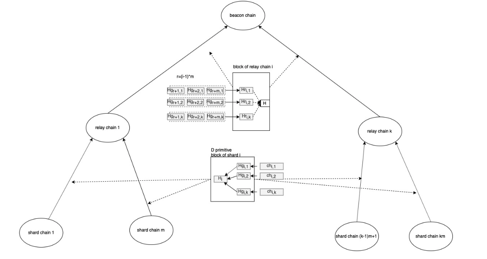

# 数据传输内容示意图：
分片-->中继-->信标 传输如下：  

信标->中继->分片如下：  

## 名词定义  
* 〖ch〗_(i,j)为由i分片发起，需要由中继链j处理的D原语的集合  
* 〖Hg〗_(i,j)=hash(ch_(i,j))是chunkg_ij对应的CID值，  
*  (Hg) ̃_(i,j)=⟨〖Hg〗_((i-1)m+1,j)│…│〖Hg〗_(2im,j) ⟩是第i个中继链中所有需要第j个中继链处理的所有哈希的集合  
* 〖Hr〗_(i,j)=hash((Hg) ̃_(i,j))是(Hg) ̃_(i,j)对应的CID值  
## 交互数据研究
### 分片 --> 中继
中继会需要关心分片的信息：
1. 分片需要中继转发的数据  
   1. 分片需要中继转发的数据有两种，一种是向其他中继转发的数据，另外一种是在本中继内转发给其他分片的数据。这两种数据可以合成一种。
   2. 存储的形式，在区块的头上存储Hi，在区块体中存储对应的\<Chi,j\>
2. 分片区块是否有效
   分片区块是否有效，需要确定投票是否有效，因此需要委员会的选举结果信息，选举结果每epoch一个，因此需要在选举结果产生的区块记录。因此选举结果信息可以由特定区块的创建者在区块生成后再生成，并且作为DigestItem提供出来
3. 分片区块的高度（顺序）
    这个可以在区块头上显示
4. 该分片的编号(包括类型及编号)
5. 算力和总节点数
### 中继 --> 分片
分片会关心中继的；
1. 委员会的选举结果，用于验证中继区块的有效性
2. 中继区块内要求本分片处理的数据
3. 中继分片的分片扩展要求
4. 中继和分片的指数
5. 该区块的类型和序列号
### 中继 --> 信标
信标会关心中继的：
1. 委员会选举结果，用于验证中继区块的有效性
2. 中继中需要转发给其他中继的数据
3. 该区块的编号（包括类型和编号）
4. 算力和总节点数

### 信标 --> 中继
中继链会需要信标链的；
1. 分片扩展要求
2. 信标链转发的需要本中继处理的数据
3. 信标链的编号(永远是FFFFFF)
4. 中继和分片指数要求

## 处理方案
### 区块头
1. 在区块头中添加链类型和编号
2. 当前的中继和分片指数（一个字节）
6. 所有打包的外源
   1. 对于分片链来说，目前主要是各个pallet提供的Call交易和选举、投票信息（其实这个也是pallet实现的）
   2. 对于中继链来说，目前主要是选举、投票信息
   3. 对于信标链来说，目前主要是选举、投票信息和全局存储及访问信息
8. 其他链的锁定信息
   1. 对于分片链来说，锁定的中继链的信息
   2. 对于中继链来说，是锁定的分片链和信标链的信息
   3. 对于信标链来说，是锁定的中继链的信息
9. 本分片内数据执行结果的状态根
10. 需要跨分片执行的执行结果的哈希根
   1. 分片链只有一个，需要中继链处理的
   2. 中继链有两个，需要其他中继链处理的（信标节点关心）和需要本中继内分片处理的（分片节点关心）
   3. 信标链只有一个，需要中继链处理的。
11. 委员会选举结果作为DigestItem在对应的区块上
12. 分片扩展要求作为一个DigestItem
13. VRF结果作为一个DigestItem（不是跨分片要求的）
14. 算力和总节点数，每100个区块通过DigestItem上报一次

### 区块体
根据区块头的分析结果，区块的不同的部分，数据读取者关心的内容不一样。例如对于中继区块，它需要根据来源分片的结果，合并出被其他中继使用的数据，这个数据信标链关心，而分片并不关心； 以及根据信标的内容，推断出需要本中继内分片处理的数据，这个数据分片关心，而信标并不关心。为了尽最大可能节省带宽，当中继节点向信标和中继内的分片传输了区块头后，系统中的节点根据自身的需求，向来源节点请求自己感兴趣的区块内中的内容。
详细的数据定义，在[区块设计](../1-区块设计.md)中

