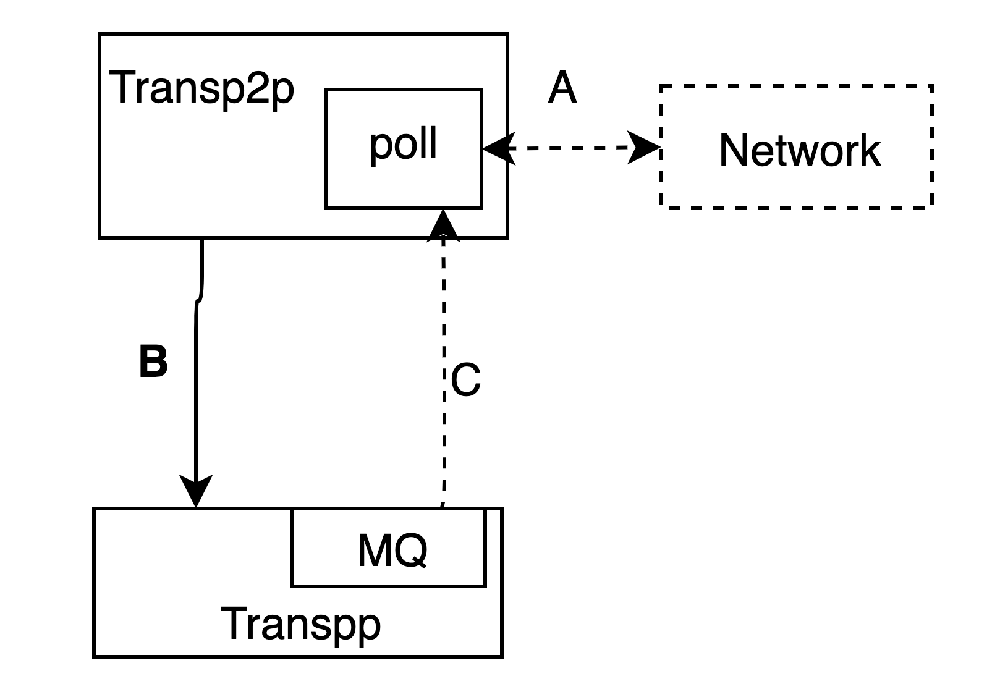

# 传输框架说明
系统中有三种类型的数据传输：
1. 邻节点推送，节点向自身的某个邻节点推送数据
2. P2P传输，节点向指定地址的节点传输数据


## 邻节点推送算法
### 推/拉算法说明
考虑节点A、B和C，A向B和C发送某个数据块，经过一段时间的延时后，B转发此数据区给C，但此时C已经收到过A发送的数据了，因此这个数据再发送一次是没有意义的。

我们使用如下的方案，当A需要向B发送数据时，A首先向B发送到一个数据传输请求，这个请求里包含了待发送数据块的哈希值，B收到这个请求后，本地检测哈希对应的数据块是否存在，只有当这个数据块不存在时，才会向A请求此数据，因此包含四个步骤：
1.  A 向 B发送 {pushhash,hash}
2.  B 向 A请求 {pullhash,hash}
3.  A 向 B发送 {pushdata,hash,data}
4.  B 验证 Hash(data) == hash

通过这个方式，使数据不会重复传输

## 点到点传输算法说明

假设有如下的网络拓扑：


### 路由管理

#### 发现请求
1. 当B需要发送数据给H时，从邻节点中寻找$\alpha$个离H更近的节点，向这$\alpha$个中继节点发送数据数据中继请求
```json
    {
            createTime:xxx, //此路由的请求时间 
            dest:H,      //目标地址，此处为H
            alpha:3,     //扩散值 
            path:None,   //源路径为空
            orgTTL:v      //初始TTL值，
            sign:sb      // B的签名

    }
```
注意这里的orgTTL和alpha与需要支持的费用相关，这个在后面的付费路由中详细描述

2. 在图中，B找到了C/D,当C/D收到此中继请求时，记录请求来源者B，然后生成一个新的路由请求：
```
    {
            createTime:xxx, //此路由的请求时间 
            dest:H,      //目标地址，此处为H
            alpha:3,     //扩散值 
            path:[B],   //源路径为空
            orgTTL:v-1      //初始TTL值，
            sign:sc      // B的签名

    }
```
与1相比，增加了path的信息，以及orgTTL-1，同时签名改成了sc,sc是具有线性特点的bls签名，即 sc = sign<sub>c</sub>(createTime)+sb。
3. 查看节点F,节点将收到来自C和D的两次路由发现请求，在第二次收到请求时，只记录路由发现的请求者C/D，等到H的回应到达后，再将回应分别发送给C/D
4. H收到E/F/G来的请求，发现是自身，通EFG向B发送回应
   
#### 发现回应
1. 发现回应过程中，节点只向上次向自己发送发现请求的节点传播数据
3. 由于节点都是不可信的，因此有可能中间的路由节点会造假，为了防止造假，节点回应的路由信息中，需要有路由目标地址的签名和中间所有中继的签名,在第一个版本中，为了简化开发，要求必须记录从上一节点到目标节点的所有签名，假设我们从B发送了到H的路由请求，然后从H返回此路由回应。
   1. H向E、F、G发送经过签名的路由回应`{createTime:xxx,ttl:0,path:[None],sign:sh}`此处的sh是h对createTime的bls签名；
   2. E/F中记录路由信息，E中
        ```json
        {
   
            minttl:1,
            pathes:[{createTime:xxx,next:H,path:None}],
            sign:se
         }
        ```
        和F中：
        ```
        { 
            minttl:1,
            pathes:[{createTime:xxx,next:H,path:None}],
            sign:sf
        }
        ```
        此处的se是e对createTime签名`se'+sh`,由于`bls`签名的线性，这个签名是可验证的。sf同理,此处把自己的签名直接生成加入，免得每次路由查询的时候需要重新生成
   3. E向C发送路由回应
        ```
        {
            createTime:xxx,
            pathes:[{next:H,pathes:None}],
            sign:se
        }
        ```
   4. F向C发送路由回应
    ```
        {
            createTime:xxx,
            path:[{next:H,pathes:None}],
            sign:sf
        }
    ````  
   5. C收到两条路由回应后，形成一条具有两条路径到H的记录,此处的sc同样是bls签名,可以通过E+F+H+C的公钥进行验证
    ```
    {   
        minttl:2,
        nexthops:[
            {next:E,createTime:xxx,pathes:[next:H,path:[None]],sign:se},
            {next:F,createTime:xxx,pathes:[next:H,path:[None]],sign:sf}
            ],
        sign:sc
    }
    ```
    为了简化起见，我们定义总表项数为ALPHA=3，当有第四个createTime的路由需要更新时，删除createTime最早的那个.
   6. C向B回应路由消息
    ```json
    {
        createTime:xxx,
        pathes:[
            {next:E,path:[{next:H,path:[None]}]},
            {next:F,path:[{next:H,path:[None]}]}
            ],
            sign:sc
    }
    ```
   7. D同样向B回应路由信息
   ```json
    {
        createTime:xxx,
        pathes:[
            {next:H,path:[None]},
            {next:F,path:[{next:H,path:[None]}]}
            ],
        sign:sd
    }
   ```
   1. B中形成路由信息
    ```json
      {
        nexthops:[
        {
               createTime:xxx,
            next:C,
             minttl:2,
            path: [
                {next:E,path:[{next:H,path:[None]}]},
                {next:F,path:[{next:H,path:[None]}]}
             ],
             sign:sc
        },
        {
            createTime:xxx,
             next:D,
             minttl:2,
             path: [
                {next:H,path:[None]},
                 {next:F,path:[{next:H,path:[None]}]}
            ],
            sign:sd,
        }
        ],
        sign:sb
      }
    ```
* 从上描述可知，minttl是可以通过遍历path来计算得到的，留着只是快捷计算而已,可以在新加入路由表项的时候，计算一次，传输过程中就不需要传输了

### 路由的更新与合并
#### 路由发现和回应中更新  
上述过程中，路由可能会在以下几个时间点产生，以B发送到H的路由发现，H回应回应中的节点F为例：
1. 当收到C发送的来自B的路由发现请求时，需要更新到B的路由
2. 当收到D发送的来自B的路由发现请求时，需要更新到B的路由
3. 当收到H的路由发现回应时，需要更新到H的路由
4. 当收到来自E的关于A路由发现回应。  
以上描述可以归类成为两种，收到路由请求和路由回应时，都应该更新路由表。

#### 数据传输时更新  
当数据从B传输到H时，假设ALPHA为2，即B->(C,D); C->(E,F), D->(F,G), F->(H), G->(H)；仍旧以F为例，F将收到来自C/D的数据中继请求，此时需要更新路由。我们有两种方案：  
1. 在数据传输的过程中，使用新的createTime,自动构建pathes信息，并且逐级对createtime进行签名
2. 在数据传输过程中，使用新的createTime,并不构建pathes，逐级对createtime进行签名  
使用第一种方案时，更新路由的模式与路由发现/回应过程一致，使用第二种方式时，需要另外考虑路由的更新和验证方案。因此经过考虑，使用第一种方案。    
注意为了在实际的数据传输过程中，为了保证数据在转发过程中不被篡改，因此也需要对数据内容进行签名，因此我们对路由表进行改造，添加一个additional项，然后对（createTime|additional)项进行签名，在路由发现回应时，additional可以是空，在数据传输时,additional是数据的哈希，这个additional在路由发现/回应时会一起传输，路由更新时并不关心additional所代表的实际含义，只是在验证签名时使用。通过这个方式，使数据发送者只需要一次签名。当然，如果数据的发送者和接收者并不关心数据的真实性或者通过另外的方式进行数据真实性验证，也可以不关心additional，通过自己定义的方式进行数据传输。

#### 邻节点失效
当设备与某个邻节点断开时，路由表项中的该项将无法实现数据路由的功能，因此应该删除此表项；但是有可能节点断了以后，过会儿又恢复了，这时候如果路由表项被删除了会导致无法恢复。同时另一方面，当路由表项非常多时，遍历路由表删除或是添加关于某个下一跳节点的路由项是代价昂贵的工作，因此我们按照如下的方案设计：
1. 设置路由表项超时时间为ExpireTime（默认10分钟）
2. 当收到路由请求时，所有的路由表项的nexthops与邻节点表比对，只有还在邻节点表中的，未超时的才有效
3. 当收到数据中继请求时，优先选择在邻节点表中的，未超时的，ttl小的

#### 更新总结  
在上述两种情况下，节点在系统中有一张等待路由更新回应的表pending_route_req,节点在路由更新时，首先更新自己的路由表，然后从路由表中拿出合并后的路由表项，在pendign_route_req中，回应对应的节点。  
事实上，由于路由捷径的存在，如果路由表中已经有表项存在了，收到路由请求时，直接已经回应了，所以pending_route_req就不会产生关于该路由的记录。 


### 路由表项管理
#### 表项合并
由于路由的更新可能存在两种情况，一种是路由发现过程中的更新，另外一种是数据传输过程中的更新，在路由发现过程中，返回
仍旧以F为例，假设B发送了一个到H的路由发现请求后，又发送了一个到E的路由发现请求，通过A/C到达了F，那么F上的路由合并分成两个部分：  
1. 对应更新中的1/2项，同一个createTime，两个不同的分支到达，直接合并
2. 同一个节点对应了两个不同的createTime（B的两个不同的createTime发送的路由请求），每个节点可以预留2个createTime，第三个到达时，使用新的createTime来替换最旧的。


#### 表项失效  
  路由失效有以下两种情况：
  1. 路由表项满的时候，按照LRU失效，这个是通过使用LruCache实现的
  2. 当路由表中的时间超过ExpiredTime时，可以认为这个路由表失效了


### 响应过程 
#### 路由发现处理
当收到路由发现请求时：
1. 如果请求的来源是记录的同一路由发现的目标节点，忽略此节点（rewound）
2. 检查路由表中是否有有效的到达目标地址的路由，如果有，直接取有有效的路由，返回给请求者
3. 如果没有，记录请求者的信息(pending_route_recv)，生成一个新的路由请求，发送给邻节点表中更近的节点
4. 记录这个请求发送的目标地址（pending_route_sent,1中需要使用）
5. 根据来源请求生成路由表项，执行和路由回应同样的处理

#### 路由回应处理
当收到路由回应时：
1. 将路由表项合并到路由表中
2. 查看pending_route_recv是否有请求该路由的项，如果有，回应表项对应的节点

**备注**
上述过程中，每一个节点都会记录向自己发送路由请求的邻节点，然后再中继此路由请求到下一节点，当收到下一节点的路由回应时，根据记录中的请求者进行回应，回应后，并不立刻删除此请求者记录，这个请求者记录具有一个超时时间，当超时时自动删除此记录。只要请求者记录还在超时时间内，就会将新路由信息发送给请求都节点，通过此方式可以实现多次路由的更新。  


#### 路由表
* 路由表的内容  
  中间的节点都需要建立一个路由关系表，路由关系表为$\{dst,next,ttl\}$,对于同一个dst，可以建立多个next路由表
* 路由表的建立  
   1) 每次收到FIND和RESP命令时，都更新路由表{dst,next,ttl} <-- {src,lastHopAddr,orgttl-ttl}
   2) 每次数据发送或回应时，都需要更新路由表

* 路由表的失效   
  路由表的失效时间根据设置的路由表大小而定，同时约定，当两个节点离上一次通信时间超过1小时，再次通信前，应该重发一次路由发现请求以重新建立路由

### 饱和度
由于在kad桶里，每个桶里的节点数都是前一个桶的一半，因此桶里节点的数量是按照指数级下降的，这样当我们使用多个桶的时候，桶里的节点的个数变化会比较多,下面是一个桶的典型分布：
```
  桶序号  |  0  |  1  |  2  |  3  |  4  |  5  |  6  |  7  |  8  |  9  |...
  节点数  |  10 |  6  |  3  |  1  |  1  |  0  |  1  |  0  |  0  |  0  |...
```
此处桶位置按照节点与自身异或后前导0的个数计算。在这种情况下，通过所在的桶定位节点的路由存在以下的问题：
1. 如节点路由的扇出数为alpha=3,那么如果一个节点落在3以上的桶里时，将无法获取两个邻节点进行中继;
2. 如果有目标节点落在5桶里，而这个桶里没有节点，那么应该使用4还是6桶的节点来进行路由，显示利用6桶进行路由的话，很大的可能在6的邻节点中，6自身是与该目标地址最近的节点，因此无法进行再次路由，路由失败。
3. 为了解决这个问题，我们引入饱和度的概念，饱和度X是这样的：
   1. 在某个桶X，如果所有的序号小于x的桶里，每个桶的节点数都大于等于alpha,并且：
   2. 条件A
      1. x+1桶的节点数小于alpha，并且
      2. 所有大于x的桶里的节点数之和大于等于alpha
   3. 或者条件B：
      1. x+1桶里的节点数大于等于alpha
      2. 所有大于x+1桶里的节点数之和小于aplha
4. 上述桶分布满足条件条件A,饱和度为2，下述桶分布是满足条件B的例子（alpha = 3)，饱和度为1
```
  桶序号  |  0  |  1  |  2  |  3  |  4  |  5  |  6  |  7  |  8  |  9  |...
  节点数  |  10 |  6  |  3  |  1  |  0  |  0  |  1  |  0  |  0  |  0  |...
```
有了饱和度的概念，我们可以做以下的路由方案：
1. 如果目标节点所在的桶小于等于饱和度X，那么从所在桶中选出特定个数（这个可以根据要求确定，经验公式选3比较合适）
2. 如果目标节点所在的桶大于饱和度X，那么所有的大于X桶中的节点都参与路由（或者从X+1桶开始，选择alpha个节点参与路由）
3. 最后，如果目标节点就是邻节点，总是会选择该节点发送（假设目标节点在0桶中，并且是邻节点，在0桶中选择时，必须把这个邻节点选中）
4. 在这种情况下，有可能会产生回环，以上述分布2为例，假如目标节点在4桶中，假设选中的2中的某个节点A作为中继节点，而节点自身也有可能在节点A的2桶里，可能被A选中作为中继节点，这样产生了回环，我们采用以下处理避免回环，：
   1. 节点记录自身向哪些节点发送了路由或中继请求
   2. 如果又收到发回来的同一个路由或是中继请求，那么就直接丢弃
   3. 节点记录自身从哪些节点收到的路由或是中继请求，在选择目标节点时，跳过来源节点。


### 数据传输
transp2p支持通过路由发送数据，因此我们考虑以下的模式
```mariad
    A-->B-->C
     -->B-->D
```
即A通过B向C和D发送同一帧数据，合理的方案是A向B发送一次数据，B向C和D各发送一次数据。为了实现此效果，我们对数据发送做以下的约定：
配合push/pull模式，如果A向B发送的转发请求的数据帧比较大时，先发送哈希，B收到转发请求时，检查哈希值，如果此哈希值在本地已经存在，就生成转发哈希请求
#### 数据发送和回应
当路由的通道建立后，就可以发送数据了，
* 发送数据
  发送数据的请求为$\{SEND,dest,\alpha,createTime,additional,pathes:[],data,sign\}$，fd是一个64位的整数，发送方用于鉴定数据是否收到的的标识
* 数据回应
  回应的数据回$\{RECV,dest,\alpha,createTime,additional,pathes,sign\}$，  
其中，
1. dest是目标地址，
2. alpha 是每级的扇出，要求发送者发送几个邻节点，这个未来与计费相关
3. createTime是生成时间，
4. additional是附加的信息，可以是空，也可以是数据的哈希，与createTime一起生成签名
5. pathes是过程路径，注意每一个请求只会有通过过一条路径到达，因此里面是一个简单的PeerId的数组
6. sign是对(createTime|additional)的bls签名
#### 机制说明
1. 路由发现完成后，两个设备间建立了虚拟连接，可以定时发送ping/pong来维持路由
2. 由于在数据层进行发送回应，因此alpha可以设置成1，然后使用超时重发的机制来降低数据发送成本。
3. 无需回应的数据消息，alpha可以从1-3之间选择，不同的alpha代表了不同的可靠性，同时也对应了不同的成本
4. 数据发送的付费问题在《支付费用》中说明


### 攻击及防范
* 放大攻击  
  由于系统中的路由命令会扩大传播，因此恶意节点可以通过发送无效的路由发现请求来占用网络带宽达到破坏网络的目的，为了避免这种攻击，我们可以通过支付费用和黑名单的形式来限制恶意节点攻击行为 

* 支付费用  
    路由通道建立，数据的传输，都需要支付费用，节点信任下一路由节点，向下一节点支付$\alpha^{orgttl}$单位的费用，下一路由节点可能没有转发此路由到更下一层节点，原因可能是没有更新的路由节点了，或者是故意吞没了前一节点的路由费用。 事实上，当路由通道建立后，可能会有大量的数据传输通过此路由通道进行，因此会有更多的收益，因此从经济上来说，转发路由发现协议更合算。  
    费用的支付是通过收据实现的，关于如何实现可合并的收据，见[此处]()


## 算法实现
### 邻节点消息定义
此处的消息是指两个邻节点之间的传输的消息，具有以下6个消息
* PUSH_HASH   推数据哈希
* PULL_DATA   请求拉哈希数据
* PUSH_DATA   推送哈希对应的数据
* FIND_ROUTE_REQ  请求路由发现
* FIND_ROUTE_RESP 路由发现回应
* RELAY_DATA_REQ  请求中继数据

#### PUSH_HASH 消息体
```rust
{
    hash:Vec<u8>
}
```
#### PULL_DATA 消息体
```rust
{
    hash:Vec<u8>
}
```
#### PUSH_DATA 消息体
```rust
{
    hash:Vec<u8>,
    data:Vec<u8>,
}
```
#### FIND_ROUTE_REQ 消息体
```rust
{
  struct FindRouteReq{
    pub src:Vec<u8>,
    pub createTime:u64, //此路由的请求时间 
    pub dest:Vec<u8>,      //目标地址，此处为H
    pub alpha:u8,     //扩散值 
    pub pathes:Vec<RoutePathItem>,   //源路径为空
    pub ttl:u8,      //初始TTL值，
    pub sign:Vec<u8>,      // B的签名
}
}
```
#### FIND_ROUTE_RESP 消息体
```rust
struct FindRouteResp{
    pub    createTime:u64,
    pub    pathes:Vec<RouteItem>,
    pub    sign:Vec<u8>,
    
}
```
#### RELAY_DATA_REQ 消息体
```rust
struct RelayDataReq{
    pub    src:Vec<u8>,
    pub    createTime:u64,
    pub    pathes:Vec<RouteItem>, 
    pub    sign_route:Vec<u8>, 
    pub    dest:Vec<u8>, 
    pub    hash:Vec<u8>,
    pub    data:Vec<u8>,
    pub    sign_packet:Vec<u8>,
   
}
```
1. 如果数据量比较小，直接附带data，否则不附带data
2. sign_route是用于更新路由表的，是对从src到pathes的签名的bls和,在传输过程中会变化
3. sign_packet是针对实际数据的签名，算法为bls_hash(src | createTime|dest|hash|data)，在传输过程中是不变的
### 内部存储结构
#### 收到的（待回应的）路由请求列表
```
route_req_recv: HashMap<PeerId,Vec<PeerId> >
```
所有收到的请求映射表
#### 已经发送的（防止回环）的路由请求
```
route_req_sent: HashMap<PeerId,Vec<PeerId> >
```
所有发送的请求映射表
#### 哈希/数据列表缓存
```
route_req_sent: HashMap<Hash,Vec<u8> >
```
哈希与数据的缓存
#### bucket桶

#### 路由表
### route表更新
* route表
```rust
pub struct RoutePathItem{
    pub next:PeerId,
    pub pathes:Option<Vec<RoutePathItem>>,
    pub sign:Option<Vec<u8>>
}

pub struct RouteItem {
    min_ttl:u8,
    createTime:u64,
    pathes:Vec<RoutePathItemSigned>,
    //对这个分支的签名
    sign:Vec<u8>,
}
```

* 数据传输的内容：
 ```rust
  struct FindRouteReq{
    pub src:PeerId,
    pub createTime:u64, //此路由的请求时间 
    pub dest:Vec<u8>,      //目标地址，此处为H
    pub alpha:u8,     //扩散值 
    pub pathes:Vec<RoutePathItemSigned>,   //源路径为空
    pub ttl:u8,      //初始TTL值，
    pub sign:Vec<u8>,      // B的签名
}
struct FindRouteResp{
    pub    createTime:u64,
    pub    pathes:Vec<RouteItem>,
    pub    sign:Vec<u8>,
    
}
 ```
在FindRouteReq的时候，有一个pathes项，这个指明了来自于src的实际路径。这个路径是单一的RoutePathItem类型的。  
在FindRouteResp的时候，也样有一个pathes项，这个项是前一节点返回出来的，是一个RouteItem的类型的数组，里面的每一项都是next/createTime区分后的RouteItem。当路由被更新后，节点从路由表中取出更新后的路由，发送给pending_route_req中对应的节点。  

### 合并路由
路由在两种时候被更新，一种是收到FindRouteReq/SendDataReq/SendDataResp时，自动根据其中的`RoutePathItem`来更新，另外一种是在收到FindRouteResp的时候，根据其中的`Vec<RouteItem>`类型的信息更新。 注意前者每次只有一条记录，而后者存在多条可能的路径。
#### `RoutePathItem` 更新
这是一个单路径，其实每个节点的pathes都是一个项。在添加的过程中，要合并路由项，合并路由项按以下的方式进行：
1. 如果有一条路径和当前的RoutePathItem完全一致，那么就直接抛弃现有的路径
2. 否则就直接添加该路径
由上可知，新路径与系统中原有的路由路径可能会有很多重复，这些部分重复的路径不能合并，因为一旦进行了部分合并，签名就不再正确，无法验证了
```rust

```
#### `Vec<RouteItem>`更新
这个是在收到FindRouteResp的时候需要处理的，每次操作时，这个数组总是来源于同一个节点，因此我们需要从路由表中找到该节点，然后合并这两个节点的路由信息。注意，这个RouteItem的下一层（pathes）就是RoutePathItem，签名是对所有的pathes进行的，因此对于数组中的每一个RouteItem，要么全部合并，要么全部丢弃。示例说明如下：
假设路由表中现有路由表项`{next:A,pathes:[{next:B,pathes:[..]},{next:C,pathes:[..]}]}`，有新的表项合并：`{next:A,pathes:[{next:B,pathes:[..]},{next:D,pathes:[..]}]}`，其合并的结果为：`{next:A,pathes:[{next:B,pathes:[..]},{next:C,pathes:[..]},{next:B,pathes:[..]},{next:D,pathes:[..]}]}`，注意这里面有两个B项，而且甚至有可能是完全一样的，但是不能缺少，原因同样是一旦删除条目，将无法验证签名。如此将产生一个结果，表项可能会越来越大。为了解决表项膨胀的问题，我们做以下的约束：
1. 针对每一个createTime，pathes表项的数量不超过3个，超过3个后，将不再增加表项
2. SendDataReq/SendDataResp/FindRouteReq/FindRouteResp的时候，每次重新生成一个createTime
3. 一个target下，最多只允许有3个createTime，超出后自动删除createTime最老的
4. createTime10分钟过期，需要维持链接的节点，每隔10分钟需要至少交互一次数据

#### 关于`createTime:u64`的优化
如果每次都使用SystemTime::Duration::as_secs()得到秒的数据，这意味着每次都会产生一个新的createTime的路由，无法与不同的其他createTime的路由合并，因此我们进行如下的优化：
1. SystemTime::Duration::as_secs() / 512 得到createTime（大约9分钟）
2. 同一个next下只允许最多有两个createTime，因为第三个到达时，第一个的路由的最早时间是1024秒之前，最新的是512秒，平均是768秒之前的了。
3. 同一个createTime到达时，具有以下几种可能性，需要分别处理：
   1. 包含，新到达的每一个分支如果被包含在原有的之内，无需作处理
   2. 不包含，原有的pathes+新的pathes小于3个，直接添加
   3. 不包含，原有的pathes+新的pathes不小于3个：新的中至少选1个（ttl最小的），然后在其余的新的+旧的pathes中保留两个ttl最小的

#### 路由表映射结构
```mermaid
graph LR
    target --> next1 
    target --> next2
    next1  --> time1(RouteItemsWithTime)
    next1  --> time2(RouteItemsWithTime)
    time1  --> RoutePathItem1_Signed(RouteItem/sign)
    time1  --> RouetPathItem2_Signed(RouteItem/sign)
 
    RoutePathItem1_Signed --> path1_noSign
    RoutePathItem1_Signed --> path2_noSign
    RoutePathItem1_Signed --> path3_noSign

    
````
可以看出time为key的表中，每一个分支是有签名的，再往下是没有签名的，有签名的目的是为了每个分支可以单独合并或是从映射表中删除


# Transp2p设计描述
## 接口描述
Transp2p通过实现与邻节点之间的数据交互，Transpp模块向上与Transp2p连接，向下与网络数据发送模块连接，如下图：  


我们根据图上的A/B/C/D四个接口分别讨论。

A是Transpp向Transp2p提交消息的接口,包括：
* 数据到达：Transpp接收到一个数据，需要提交给Transpp处理
   
B是Transp2p向Transpp发送的请求，可以是函数调用，因此使用实线箭头表示，包括：
* 请求数据中继

C是网络层向Transpp发送的消息，包括：
* RelayData请求中继数据
* PullData请求获取哈希对应的数据
* PushData推送哈希对应的数据

D是Transpp模块向网络层发送数据的请求，同样可以是函数调用（假如网络层支持），因此使用实线箭头表示，同样包括：
* RelayData请求中继数据
* PullData请求获取哈希对应的数据
* PushData推送哈希对应的数据

此处我们可以推断，Transpp使用使用网络模块进行数据的发送和接收，路由部分同样需要使用网络模块，为了网络模块被多个客户端模块调用产生问题，我们改造结构如下：  

在Transpp中添加一个消息队列，这里面的核心是Transp2p的poll函数，poll函数从transpp/network的消息队列中中获取事件数据进行分分析事件，属于需network处理的分配给network,需要transpp处理的分配给transpp。
## 实现过程说明
在P2P网络中，一个节点具有多个邻节点，因此有可能会多个邻节点收到同一数据，这样对网络带宽造成极大的浪费。为了解决这个问题，transpp使用push/pull的方式进行数据传输。push/pull传输定义如下：
1. 如果数据小（小于等于256字节），直接发送
2. 如果数据大于256字节，首先发送哈希值
3. 对方收到此数据后，检查本地是否有哈希值对应的数据，如果没有，向来源节点发送pulldata请求
4. 源节点收到pulldata请求后，向请求者发送pushdata，把哈希及对应的数据推送给请求者
数据收取成功后，再通知上层应用有数据到达。
### 特殊情况考虑：
1. 节点在收到A推送的数据后，又收到B推送的同样数据，这时候节点还在向A请求数据的过程中，不应该立刻向B请求数据，这个需要处理。
2. 上述的情况下，如果从A请求数据失败了（比如A正好断线了），应该再向B请求数据。
3. 两次同样的数据到达，应该只向上层服务汇报一次
### 优化数据复制工作
PushData的数据有可能会比较大，如果不作任何处理，数据从Transp2p传输到Transpp，需要做数据复制，Transpp再通知给Transp2p，又需要做一次复制，然后由Poll通知Network传输，又需要一次复制。这些数据复制工作极大降低了系统的效率。
为了解决这个问题，我们可以用两种方式：
### 方案1：
我们在Transp2p中建立数据缓存，然后把数据缓存的句柄提交给Transpp，数据缓存的工作在Transp2p中执行，Transpp可以查询哈希对应的数据是否存在，从而决定行为操作。  
在这种方案下，pulldata从transp2p模块被转发到transpp模块，transpp读取位于Transp2p模块中的data_cache，然后再回应消息给Transp2p。这个流程感觉是完全多余的，不是非常合理

### 方案2：
把Transpp的功能合并到Transp2p里，这样所有多余的流程全部可以取消了。但是这样会使Transp2p功能更多，没有保持精简。  
最终方案使用方案2，然后使用rust的trait模式来使Transp2p的实现可以分功能模块实现，以保持简洁性。

# 数据发送过程的路由问题
当数据无法找到目标节点的路由时，有两种方案，一种是自动发现路由，一种是直接丢弃。 实现中，兼有这两种方式：在传输数据包中有自动发现的标志位，如果该标志位是1，则在没有到目标节点的时候，自动发现。

# 路由攻击：
由于路由表数量有限，因此可以通过洪水攻击的以下的方式来攻击路由表：
在节点上生成很多地址A1...Axxx，构造从Ax发出的路由发现请求，然后转发给B，这时候B中会记录目标为A1。。。Axxx的路由，由于每个节点中的路由表项有限，因此可能会导致路由表被这些无效的路由表项占据，为了解决这个问题：
1. 通过收费方式提高攻击者的成本
2. 限制同一节点来的数据包速率

# GroupSet设计说明
在分片网络中，网络被划分成多个分片，反过来说，可能是网络中的某一部分节点属于某个分片，因此分片内的节点有可能互不连接，因此我们采用路由的方案。  
实际上，分片的节点是通过Start Provider和GetProvider来进行管理的，GetProvider命令读取最多20个节点。而网络组播就是向这20个节点发送数据，在路由过程中，有可能某个路由节点也属于此节点：  

如图，A看到分片节点是C和D，从A到达C/D的路由过程中，会经过B，实际上B也是该分片中的一部分，但是如果不作处理，由于数据是要发送给C/D，因此B是不处理该数据的。对此有两种处理方案：
1. 不作处理，B会由其他节点传输过来
2. 在数据传输时，在数据之外加一个标识值，该标识值随着数据一起传输，传输过程中的节点会根据这个标识值决定是否需要在本地处理。
本系统使用后者。