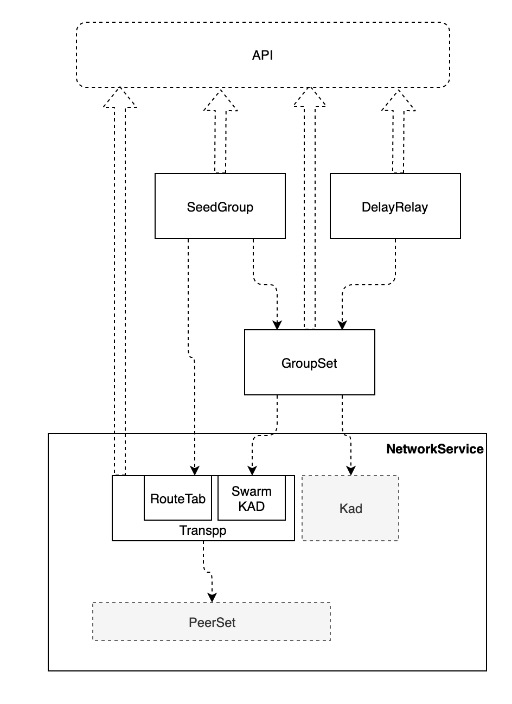

# 改造目标
1. 实现单播、组播
2. 非连接状态下的节点发现
   1. 或者使用UDP的虚拟连接？
3. 基于组播的客户端/服务器收发（可选）

# 改造方案

对系统改造后，形成一个新的NetworkBehaviour，对外提供NetworkService接口。总体框架中具有多个模块，
1. 数据传输名称为Transp2p，这个模块又依赖三个子模块：其中
    1. Transpp中有实现了具有路由功能的单播，与直接的数据发送相比，增加了两个功能：
       1. 与DHT不同，transpp的路由是通过发现后记录在模块中的，实现了定路由，通过此方式提高转发的效率。
       2. 通过push/pull方式发送数据的功能，源节点首先向目标邻节点发送哈希(push)，目标节点检查发现自身的没有该哈希对应的数据时，才去请求实际数据（pull)，这个方式与原始的方案相比，在一对多/多对一/多对的数据传输时，可以避免数据的重复传输。
    2. RouteTab实现了路由表的管理，包括生成、失效、合并读取等
    3. Swarm KAD提供了一个具有饱和度计算的KAD网络
2. GroupSet提供群组创建、加入、退出、组播等功能
3. DelayRelay提供了延时中继的功能
4. SeedGroup实现了一类特定形式的分组，该分组由一个或多个seed节点作为源，形成分组，全节点可以动态加入此分组充当分发器，轻节点可以请求某些全节点加入此分组，同时可以实现客户端与seed节点之间的双向数据传输
以上前三个模块组合成了一个NetworkService模块
## Transpp模块
* Transpp模块用于通过DHT网络进行数据传输，在原有的DHT不定路由的基础上，实现定路由功能。
* Transpp通过Kadmelia实现路由发现，可以实现节点之间的的无重复数据传输
## GroupSet模块
* GroupSet向上提供创建分组，加入分组、离开分组以及向分组广播数据的功能。
* 一个节点可能会属于多个分组，因此从同一个节点可能会收到属于多个分组的数据，groupset需要地收到的数据进行分析，确认属于哪个组后向上传播
## Delay Relay模块
* Delay Relay是允许延时发送的模块，提供数据的缓存和延时发送的功能，
* 同时提供未发送数据清除和数据发送完毕后的事件响应
## SeedGroup模块
* 有源组，具有数据发布源和消费者的的组,可以用于直播

# 附加说明
## behaviour实例
参考如下的图示：  

详细说明可以参考 [substrate p2p](../../Substrate代码研究/substrate框架分析/../libp2p研究/libp2p-behaviour.md)

系统图中的Protocol模块和KAD模块是上图中的behaviour实例