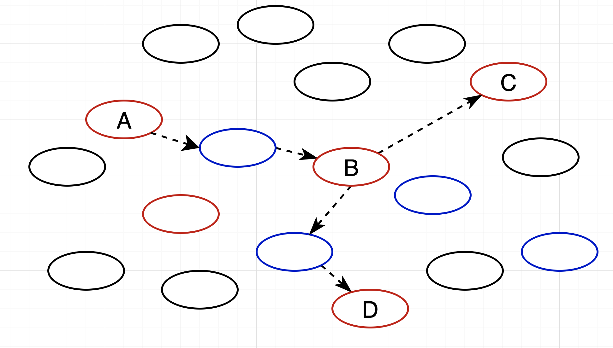

# 传输框架说明
系统中有三种类型的数据传输：
1. 邻节点推送，节点向自身的某个邻节点推送数据
2. P2P传输，节点向指定地址的节点传输数据

# GroupSet设计说明
在分片网络中，网络被划分成多个分片，反过来说，可能是网络中的某一部分节点属于某个分片，因此分片内的节点有可能互不连接，因此我们采用路由的方案。  
实际上，分片的节点是通过Start Provider和GetProvider来进行管理的，GetProvider命令读取最多20个节点。而网络组播就是向这20个节点发送数据，在路由过程中，有可能某个路由节点也属于此节点：  

如图，A看到分片节点是C和D，从A到达C/D的路由过程中，会经过B，实际上B也是该分片中的一部分，但是如果不作处理，由于数据是要发送给C/D，因此B是不处理该数据的。对此有两种处理方案：
1. 不作处理，B会由其他节点传输过来
2. 在数据传输时，在数据之外加一个标识值，该标识值随着数据一起传输，传输过程中的节点会根据这个标识值决定是否需要在本地处理。
本系统使用后者。