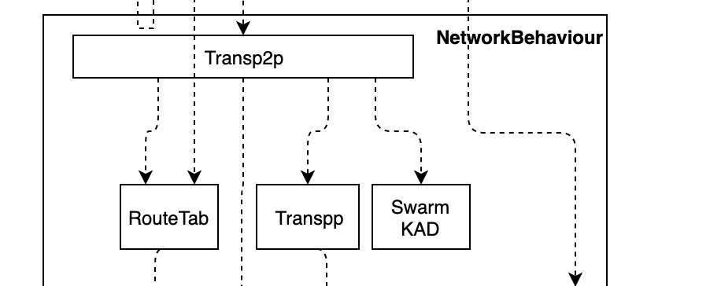

# 概述
Transp2p模块里包含四个部分：如下图所示：

从图上可以看到,Transp2p内需要使用RouteTab和SwarmKAD两个对象的实例，完成了RouteManage/Transpp两个特质，并且需要实现NetworkBehaviour特性。
# Transp2p
## 数据结构
```rust 
#[derive(Debug, Eq, PartialEq,Clone,Encode,Decode)]
pub struct EnginedData {
    pub engine_id:ConsensusEngineId,
    pub date:Vec<u8>,
}
pub struct RelayDataWrapper<B:Hash>{
    pub    routeInfo:FindRouteReq,
    pub    tags:Vec<u8>,
    pub    hash:B::Out,
    pub    data:Option<Arc<RwLock<EnginedData>>,
    pub    sign_packet:Vec<u8>, 
}
```
## 数据定义：
### 需要发送的事件队列
```rust
    events:Vec<Event>
```
由于一个事件的处理可能会产生多个事件（比如说数据转发），因此我们使用events来缓存和记录需要多个待处理的事件。
### 监听的标识
```rust
    monitor_tags:HashSet<String>
```
这个是记录监听的标识，数据的标识在monitor_tags中，即使目标地址不是自己，也会获取该数据，并且向应用层汇报

### 消息队列
消息队列用于存放需要Transp2p处理的消息
```rust
    event_sinks: HashMap<Vec<u8>,Vec<mpsc::UnboundedSender<Transp2pOut<B>> >,
```
这个是`HashMap<engine_id,tx>`的对象，当数据到达时，通过engine_id分发给相应的事流接收器

#### 已转发队列
最近的已经向转发过的中继请求，这是为了避免多次处理
```rust
    processed_cache:Hashet<(target,hash))>
```
这里使用的是target,hash，因此需要考虑以下两点：
1. 如果要求中继的数据是直接数据，也需要生成一下哈希用于记录
2. 如果有多个节点请求往同一目标节点发送数据，只有第一次的会被转发，后续的会被丢弃
* 在这种处理模式下，如果第一次数据到达，转发没有成功，第二次再到达时，即使此时转发可能成功，也不会再进行转发动作了。

### 函数定义
### 函数定义
#### 新建
##### 函数签名
    `new()->Self`
##### 响应动作
创建一个对象返回
####  发送数据
    发送者使用{engine_id,data} 创建一个对象，放到events中，等待poll读取后，使用send_message进行发送            
##### 函数签名
`send_message(targets:Vec<PeerId>, alpha:usize, ttl:usize, tag:Cow<'a,&[u8]>,data:Arc<RwLock<EnginedData>>)`        
##### 响应动作
1. 根据targets读取路由表，产生相应的下一跳节点ids
2. 根据data生成哈希
3. 生成RelayDataWrapper类型的 relay_req
   1. 根据data生成哈希
   2. 生成结果
4. 使用新的relay_req产生事件放置到events中
####  设置接收事件流      
##### 函数签名
 `register_event_stream( engine_id:Cow<'a,str>)->  mpsc::UnboundedReceiver<Transp2pEvent>` 
##### 响应动作
1. 生成一个(tx,rx)对
2. 在event_sinks中根据engine_id来注册rx
3. 返回rx 
####  注册监听的tags      
##### 函数签名
  `hook_tags( tags:Cow<'a,str>)->  Cow<'a,str>` 
##### 响应动作
1. 用','分割tags,得到多个tag
2. 向monitor_tags中添加这些tag
3. 把monitor_tags中所有的tag用','连接，生成字符串返回
####  清除监听的tags       
##### 函数签名
 `remove_tags( tags:Cow<'a,str>)->  Cow<'a,str>` 
 ##### 响应动作
 1. 用','分割tags,得到多个tag
2. 向monitor_tags中添加这些tag
3. 把monitor_tags中所有的tag用','连接，生成字符串返回

#### 数据到达
##### 函数签名
`proc_data_arrival(DataRelayWrapper)`
#####  响应动作
1. 如果(target,hash)已经在processed_cache中，则返回None,
2. 如果tag在monite_tags列表中，或者targetId是自身，根据engine_id寻找相应的event_stream进行分发
3. 如果targetId不是自身
   1. 根据路由表寻找到达这个targetId的所有邻节点
   2. 生成每个邻节点的转发请求事件，放到events中
4. 在processed_cache中添加该(target_hash)信息


## Transpp特质实现
### 数据定义
#### 数据缓存
数据缓存是哈希/Vec<u8>的映射，用于存放已知的哈希值及其对应的数据，目前第一个版本使用LruCache，未来是否需要使用LruCache+db进行持久化存储？
```rust
    data_cache:HashMap<hash,Arc::<RwLock::Vec<u8>>>)
```
注意内容是一个Arc::<RwLock::Vec<u8>>>,这是为了不同的线程之间传递消息时，避免对数据进行复制，使用RwLock是由于数据可能被多个线程读取，与Mutex相比，可以读时读取，性能更高一些。  
由于Vec是在堆上生成的，因此此方式无需考虑生命周期问题

#### 读取队列
读取队列用于记录当前的正在发送请求获取对应数据的哈希值，同时还记录了所有可能具有该数据的节点（从其他节点推送了同样的数据请求）
```rust
    retrieving_cache:HashMap<hash,(Vec<RelayDataReq>,Vec<RelayDataReq>)>
```
  哈希映表表是一对元组，前表示当前已经/正在获取数据的节点，后面表示新到达后，还没有查询过是否有哈希对应的数据的节点。
#### 事件定义
```rust
#[derive(Debug)]
pub enum TransppEventIn<B:Hash> {
    RelayDataEvt(RelayDataReq<B>),
    PullDataEvt(PullDataReq<B>),
    PullDataRespEvt(PullDataResp<B>),
    RelayDataArrive(RelayDataReq<B>),
    None,
}
```

##### 事件的数据结构
```rust 
#[derive(Debug, Eq, PartialEq,Clone,Encode,Decode)]
struct RelayDataReq<B:Hash>{
    pub    routeInfo:FindRouteReq,
    pub    tags:Vec<u8>,
    pub    hash:B::Out,
    pub    data:Option<Vec<u8>>,
    pub    sign_packet:Vec<u8>, 
}
#[derive(Debug, Eq, PartialEq,Clone,Encode,Decode)]
pub struct PullDataReq<B:Hash> {
    hash: B::Out,
}
#[derive(Debug, Eq, PartialEq,Clone,Encode,Decode)]
pub struct PullDataResp<B:Hash> {
    hash: B::Out,
    data: Option<Vec<u8>>,
}
``` 


#### 网络事件到达
##### 响应动作
匹配事件消息类型，调用相应的函数进行处理：
 * DataRelayReq =>  on_relay_data
 * PullData => on_pull_data
 * PushData => on_push_data
#### poll
##### 响应动作
如果events中有事件，如果是RelayReq事件，生成SendEvent事件，并且 Poll::Ready()此事件，否则返回Poll::Pending

#### on_relay_data

##### 响应动作
1. 检查target/hash对，如果已经在reported_cache中，就结束
2. 如果data有数据，构建RelayDataArrive（relay_req）放到events中
3. 在reported_cache中添加该target/hash记录
4. 如果在retrieving_cache中有该哈希，将relay_req添加到retrieving_cache的Vec队列中，结束
5. 如果在retrieving_cache中没有该哈希，创建一个哈希和`Vec<relay_req>`的记录，然后
6. 创建一个`PullDataEvt（PullDataReq{peerId,relay_req.hash>}`的事件，放到events中

#### on_pull_data
##### 响应动作
1. 如果data_cache中有，生成{hash,Some(value)}的PushData对象，
2. 如果data_cache中没有，生成{hash,None}的PushData对象
3. 使用write_notification写入到来源的PeerId中去

#### on_push_data
##### 响应动作
1. 如果回应的是{hash,Some(data)}对象，那么
   1. 数据存入到data_cache
   2. retrieving_cache中取出哈希所有对应的项，调用并返回on_data_arrival结果
2. 如果回应的是{hash,None}对象，那么：
   1. 从retriveing_cache值的self.1号取出第一个元素，如果有
      1. push到self.0中
      2. 生成并返回发送给PullData请求事件
   2. 如果无，返回Poll::None


# SwarmKAD
# RouteTab